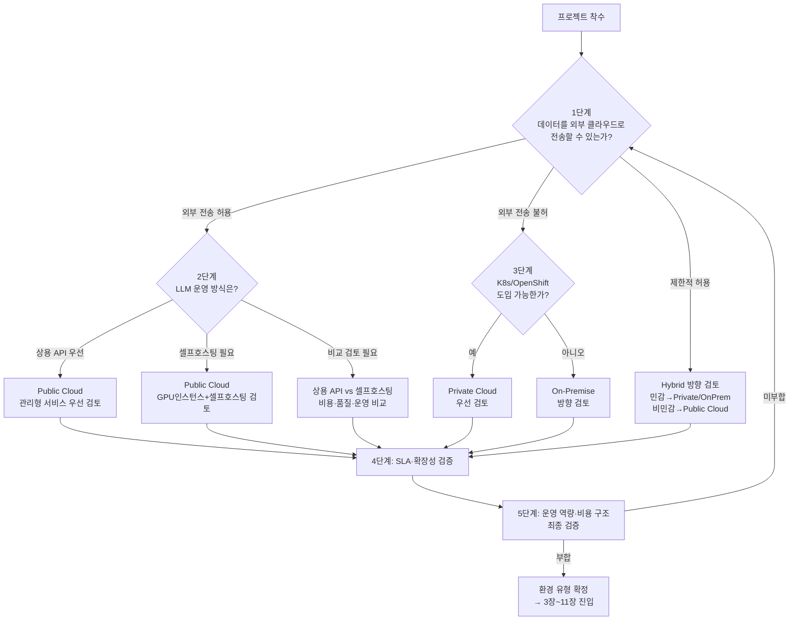
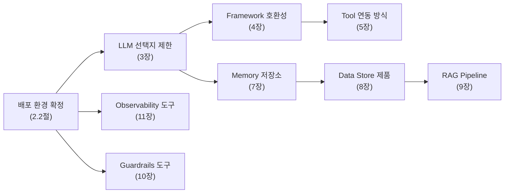

# 2.2 배포 환경 유형과 인프라 제약

AI Agent의 기술 선정은 **"어떤 기술을 고르는가"**뿐 아니라 **"어디에서 실행하는가"**에 의해서도 크게 달라진다.

배포 환경은 3장~11장 전체에 걸쳐 선택지를 제한하는 **횡단 조건(Cross-cutting Constraint)**이므로, 개별 영역 선정에 앞서 환경 유형을 먼저 확정해야 한다. 환경 유형이 달라지면 동일한 기능 요구사항이라도 선택 가능한 기술 후보군이 근본적으로 달라질 수 있기 때문이다.

**이 절의 위치와 역할**

- 2.1절(Agent Topology)에서 SAS/MAS를 결정한 **직후**, 이 절에서 배포 환경을 확정한다.
- 이 절의 결론(환경 유형)은 3장~11장 각 의사결정 트리의 **입력 조건**이 된다.
  - 예: 3장 LLM 의사결정 트리 "분기 1: 배포 환경 필터"는 이 절의 결론을 직접 참조한다.
- 2.3절(기술 영역 간 의존 관계)은 이 절에서 확정한 환경이 어떤 **연쇄 영향**을 일으키는지를 맵으로 보여준다.

**강도 기준**: 본 절에서 사용하는 MUST, SHOULD, MAY의 정의는 5.1.3절(RFC 2119 준용)을 따른다.

---

## 2.2.1 배포 환경 유형 정의

AI Agent 시스템의 배포 환경은 아래 **네 가지 유형**으로 구분한다.

| 유형 | 정의 | 핵심 키워드 |
|---|---|---|
| **Public Cloud** | AWS·Azure·GCP 등 외부 사업자의 관리형 인프라 사용 | 종량제, 관리형 서비스, 상용 LLM API **또는** GPU 인스턴스 기반 셀프호스팅 |
| **Private Cloud** | 자체 데이터센터에 OpenShift·Kubernetes 등 컨테이너 플랫폼을 구축하여 Cloud-like 운영 | 데이터 격리, K8s 오케스트레이션, 셀프호스팅 |
| **On-Premise** | 베어메탈·VM 기반 자체 인프라를 직접 구축·운영 (컨테이너 플랫폼 없음) | 폐쇄망, 수동 운영, 최소 외부 의존 |
| **Hybrid** | 데이터 민감도에 따라 Public Cloud + Private Cloud / On-Premise를 혼합 | 워크로드 분리, 데이터 등급 기반 라우팅 |

> **Private Cloud를 별도 유형으로 분리한 근거**: 컨테이너 오케스트레이션 플랫폼의 유무는 GPU 스케줄링, 선언적 배포, 오토스케일링 가능 여부를 결정하며, 이는 3장~11장의 기술 선택지를 근본적으로 분기시킨다. 동일하게 "데이터 외부 전송 금지"인 환경이라도 K8s 기반(Private Cloud)과 베어메탈(On-Premise)은 운영 복잡도·확장성·기술 후보군에서 큰 차이를 보이므로, 의사결정 정밀도를 위해 분리한다.

---

## 2.2.2 환경 유형 판단 기준

프로젝트 착수 시 아래 **5단계 질문**을 순서대로 확인하여 환경 유형의 방향을 결정한다(SHOULD). 각 단계는 이전 단계의 결과를 입력으로 받으므로, **1단계부터 순차적으로 진행**한다.

### 판단 흐름 요약

### 1단계 — 데이터 외부 전송 허용성 판단 (최우선)

AI Agent는 사용자 질의·문서·업무 데이터를 LLM에 전달하므로, **처리 대상 데이터의 외부 전송 가능 여부**가 환경 유형을 가장 크게 좌우한다.

| 질문 | 답변 | 판단 방향 | 기술적 근거 |
|---|---|---|---|
| AI Agent가 처리하는 데이터를 외부 클라우드로 전송할 수 있는가? | **외부 전송 허용** | → 2단계로 이동 | 상용 LLM API 또는 클라우드 GPU 인스턴스 기반 셀프호스팅 모두 선택 가능 (→ 3장 LLM 선정 분기 1) |
| | **외부 전송 불허** | → Private Cloud 또는 On-Premise 방향, 3단계로 이동 | 개인정보보호법·금융위 클라우드 이용 가이드·ISMS-P·국방 보안규정 등에 의해 외부 전송이 금지되는 경우, **오픈소스 LLM 셀프호스팅이 필수**(MUST)이며 GPU 인프라를 내부에 확보해야 함 (→ 3장 분기 2-A 온프레미스 경로) |
| | **제한적 허용** | → Hybrid 방향, 4단계로 이동 | 데이터 등급(공개/내부/기밀)에 따라 비민감 질의는 상용 API로, 민감 질의는 내부 모델로 분기하는 **라우팅 레이어 설계**가 필요 (→ 3장 분기 1 하이브리드 라우팅) |

**하이브리드 라우팅 설계 포인트** (1단계에서 "제한적 허용"으로 진입한 경우)

하나의 시스템 안에서 온프레미스와 상용 API를 동시에 운영하게 되므로, 아래 항목을 사전에 설계한 뒤 각 경로별로 2단계/3단계에 진입한다(SHOULD).

- 데이터 분류 기준: 공개/내부/기밀 등급별 라우팅 규칙 사전 정의
- Fail-safe 설계: 분류 실패 시 온프레미스 기본 라우팅 권장
- 네트워크 연결: VPN·전용선(Direct Connect / ExpressRoute)·PrivateLink 등 보안 연결 구성
- 지연 시간 설계: 온프레미스↔클라우드 간 네트워크 레이턴시가 서비스 SLO를 충족하는지 사전 검증

배포 환경 판단 시 데이터 외부 전송 **허용성 수준(허용/제한/금지)**과 함께 **연결 격리 수준**을 동시에 정의해야 한다(SHOULD). 연결 격리 수준은 `L1 Internet`, `L2 Private Endpoint`, `L3 Dedicated Line`, `L4 Air-gapped`로 구분하고, 각 수준별 허용 LLM 호출 경로와 egress 정책을 명시한다. Hybrid 환경에서는 등급별 라우팅 규칙과 연결 격리 수준을 일관되게 설계한다.

### 2단계 — LLM 운영 방식 및 인프라 전략 (데이터 외부 전송 허용 시)

외부 전송이 허용되더라도, LLM 운영 방식(상용 API vs 셀프호스팅)은 별도의 의사결정 축이다. 비용·모델 커스터마이징·벤더 독립성·지연 시간 요구에 따라 **Public Cloud 위에서 오픈소스 모델을 셀프호스팅**하는 것이 유리한 경우가 존재한다.

| 질문 | 답변 | 판단 방향 | 기술적 근거 |
|---|---|---|---|
| LLM 운영 방식은? | **상용 API 우선** | → **Public Cloud 관리형 서비스** 우선 검토 | Bedrock·Azure OpenAI·Vertex AI 등 관리형 서비스를 사용하면 GPU 프로비저닝·모델 배포·오토스케일링을 사업자가 처리하므로 Time-to-Market이 가장 짧음 (→ 3장 분기 2-B 상용 API 경로) |
| | **셀프호스팅 필요** | → **Public Cloud GPU 인스턴스 + 셀프호스팅** 검토 | 파인튜닝/LoRA 적용 모델 서빙, 벤더 락인 회피, 대량 추론 시 토큰당 비용 절감, VPC 내부 서빙으로 지연 시간 통제 등이 동기. EKS/AKS/GKE GPU 노드풀에서 vLLM/TGI를 운영 (→ 3장 분기 2-A 셀프호스팅 경로, 단 인프라는 Public Cloud) |
| | **비교 검토 필요** | → 상용 API vs 셀프호스팅 **TCO·품질·운영 부담**을 비교 | 워크로드 규모가 확정되지 않았거나, 상용 API와 셀프호스팅을 병행할 가능성이 있는 경우. 3.4절 모델 조합 전략에서 상용+오픈소스 혼합 운영 설계를 참조 |

**Public Cloud 셀프호스팅을 선택하는 주요 동기**:

- **비용**: 대량 추론 시 GPU 인스턴스 예약(Reserved/Savings Plan)이 상용 API 토큰 과금 대비 저렴
- **모델 커스터마이징**: 파인튜닝·LoRA 적용 모델은 상용 API로 서빙 불가하거나 제한적
- **지연 시간 통제**: VPC 내부 서빙으로 네트워크 홉 최소화, 예측 가능한 레이턴시 확보
- **벤더 독립성**: 특정 LLM Provider에 종속되지 않는 아키텍처 확보
- **데이터 처리 투명성**: 상용 API의 로깅·학습 정책에 대한 우려 해소 (외부 전송 불허는 아니지만 선호하지 않는 경우)

### 3단계 — 컨테이너 플랫폼 유무 (데이터 외부 전송 금지 시)

데이터 외부 전송이 금지된 환경에서 AI Agent를 운영하려면, 모델 서빙·Vector DB·Observability 등 여러 컴포넌트를 내부에 직접 배포해야 한다. 이때 **컨테이너 오케스트레이션 플랫폼의 유무가 운영 복잡도와 확장성을 결정짓는 핵심 분기점**이 된다.

| 질문 | 답변 | 판단 방향 | 기술적 근거 |
|---|---|---|---|
| OpenShift·Kubernetes 등 컨테이너 플랫폼을 운영 중이거나 도입 가능한가? | **예** | → **Private Cloud** 우선 검토 | K8s 기반 GPU 스케줄링(NVIDIA GPU Operator), Operator 패턴에 의한 모델 서빙·DB·모니터링의 선언적 배포, HPA/VPA를 활용한 Pod 단위 오토스케일링 등 Cloud-like 운영이 가능 (→ 4장 Framework 선정 시 K8s 네이티브 도구 우선) |
| | **아니오** | → **On-Premise** 방향 검토 | 베어메탈·VM 위에 vLLM/TGI를 직접 설치·운영하는 구조. 배포 자동화·롤링 업데이트·장애 복구가 수동에 가까우므로, 소규모·고정 사용자 환경에 적합 |

### 4단계 — SLA·확장성 요구 수준

환경 유형 방향이 정해진 뒤, 실제 서비스 수준 목표에 따라 구체적인 인프라 구성을 조정한다.

| 질문 | 답변 | 권장 환경 | 기술적 근거 |
|---|---|---|---|
| 서비스 가용성(SLA) 및 트래픽 탄력성 요구 수준은? | **SLA 99.9%↑, 트래픽 급변 대응 필요** | Public Cloud 권장 (관리형 서비스 또는 K8s 오토스케일링) | Multi-AZ 자동 Failover, 관리형 엔드포인트의 수 초 내 오토스케일링 또는 EKS/AKS/GKE GPU 노드풀 Karpenter/Cluster Autoscaler 활용 |
| | **SLA 99.5% 수준, 트래픽 예측 가능** | Private Cloud 적합 | OpenShift HPA 기반 Pod 스케일링으로 대응 가능하나, 스케일 상한은 물리 노드 수에 종속되므로 사전 용량 계획 필요 |
| | **내부 SLA, 소규모 고정 사용자** | On-Premise 허용 | 단일 GPU 서버에서 vLLM/Ollama로 서빙하는 단순 구성으로도 충분. 다만 단일 장애점(SPOF)에 대한 수용이 전제됨 |

### 5단계 — 조직 운영 역량 및 비용 구조 최종 검증

앞 단계에서 도출된 방향이 조직의 현실적 역량과 예산 구조에 부합하는지 최종 점검한다. 부합하지 않으면 **이전 단계로 돌아가 대안을 재검토**한다(SHOULD).

| 질문 | 답변 | 고려사항 |
|---|---|---|
| K8s/OpenShift 운영 경험과 GPU 관리 인력이 확보되어 있는가? | **미확보** | Private Cloud·On-Premise를 선택할 경우 GPU 드라이버·CUDA 버전 관리, 모델 양자화 튜닝, 서빙 파이프라인 장애 대응 등의 운영 부담이 크므로, Public Cloud(관리형 서비스 또는 관리형 K8s + 셀프호스팅)로 재검토하거나 외부 운영 위탁(Managed Service)을 함께 고려 |
| | **확보** | Private Cloud·On-Premise 또는 Public Cloud 셀프호스팅 운영 가능. 다만 모델 업데이트 주기, GPU 노드 증설 계획, 클러스터 업그레이드 전략 등 중장기 운영 로드맵을 사전에 수립해야 함(SHOULD) |
| 예산 구조가 CapEx(선투자) 중심인가, OpEx(종량제) 중심인가? | **OpEx 선호** | Public Cloud가 유리. 상용 API 종량제 또는 GPU 인스턴스 예약 인스턴스·Savings Plan으로 40~60% 절감 가능하며, 사용량 변동에 따라 유연하게 조정 |
| | **CapEx 가능** | Private Cloud·On-Premise가 가능. 초기 GPU 서버 투자 비용이 높으나 3년 이상 장기 운영 시 토큰당 단가가 상용 API 대비 유리해질 수 있음 (TCO 분석 권장) |

---

## 2.2.3 환경 유형별 기술 선정 영향

2.2.2의 의사결정 플로우를 거쳐 환경 유형이 정해지면, 아래에서 해당 유형의 기술 선정 영향을 확인한 뒤 3장~11장에 진입한다.

LLM 후보가 정해지면 **추론 서빙 구조**(예: vLLM/TGI/Triton, 실시간/배치, 단일/다중 모델)를 환경 제약에 맞춰 확정해야 한다(SHOULD). Public Cloud는 관리형 추론 엔드포인트 또는 GPU 인스턴스 기반 셀프호스팅을 검토하고, Private Cloud/On-Premise는 GPU 스케줄링·확장 전략을 포함한 셀프호스팅 서빙 구조를 정의한다. 서빙 구조 결정 결과는 4장 Framework 및 11장 Observability 설계 입력으로 사용한다.

### Public Cloud 환경 (AWS, Azure, GCP)

**특성**: 관리형 서비스 활용 가능, 자동 스케일링 지원, 초기 투자 없이 종량제(OpEx) 사용. **상용 LLM API와 GPU 인스턴스 기반 셀프호스팅을 모두 선택할 수 있는** 환경.

**기술 선정 영향**:
- **LLM(3장)**: 두 가지 경로가 존재한다.
  - *경로 A — 상용 API*: AWS Bedrock, Azure OpenAI, GCP Vertex AI 등 관리형 서비스 즉시 사용 가능. 3.2절 의사결정 트리 분기 2-B(상용 API 경로)로 진입.
  - *경로 B — 셀프호스팅*: EKS/AKS/GKE GPU 노드풀(H100, A100, L4 등)에서 vLLM/TGI로 오픈소스 모델 서빙. 3.2절 분기 2-A(셀프호스팅 경로)로 진입하되, 인프라 관리(GPU 프로비저닝, 오토스케일링)는 클라우드 사업자가 지원.
  - 경로 A와 B를 **동일 VPC 내에서 병행**(상용 API + 셀프호스팅 혼합)하는 것도 가능하며, 이 경우 3.4절 모델 조합 전략을 참조한다.
- **Framework(4장)**: 모든 Framework가 상용 LLM Provider를 네이티브 지원하며, 셀프호스팅 모델에 대해서도 OpenAI-compatible API를 통해 동일 인터페이스로 연동 가능.
- **Data Store(8장)**: 관리형 Vector DB 활용 가능 — Aurora pgvector, Azure AI Search, Vertex AI Vector Search, Pinecone.
- **Observability(11장)**: SaaS 도구(LangSmith, Helicone) 즉시 연동 가능. 셀프호스팅 모델 경로에 대해서도 동일 SaaS 도구로 통합 모니터링 가능.

**고려사항**: 데이터가 외부 클라우드로 전송되므로 데이터 주권(Data Sovereignty) 및 규제 요건 확인 필수(MUST). 셀프호스팅 경로 선택 시 GPU 인스턴스 비용 최적화(예약/스팟)와 서빙 파이프라인 운영 역량을 사전에 확보해야 한다.

**적합 시나리오**: PoC/시연, 글로벌 서비스, 탄력적 트래픽 대응이 필요한 서비스, 파인튜닝 모델 서빙이 필요하지만 자체 GPU 하드웨어 투자를 원하지 않는 조직.

> 사업자별 세부 비교(AWS/Azure/GCP/OpenShift)는 2.2.7절 참조 문서를 확인한다.

### Private Cloud 환경 (OpenShift / Kubernetes 기반)

**특성**: 자체 데이터센터에 K8s 플랫폼을 구축하여 Cloud-like 운영. 데이터가 자체 인프라에 유지되어 외부 유출 원천 차단. Operator 패턴·GitOps 등 선언적 관리 가능.

**기술 선정 영향**:
- **LLM(3장)**: 오픈소스 모델 셀프호스팅 필수(MUST) — vLLM/TGI를 OpenShift AI(RHOAI) 또는 Pod로 배포. 3.2절 분기 2-A(온프레미스 경로)로 진입.
- **Framework(4장)**: K8s 네이티브 배포를 전제로 Framework를 선정. Durable Execution이 필요하면 LangGraph의 Checkpointer 활용 가능.
- **Data Store(8장)**: Milvus·Qdrant·Weaviate 등을 Operator/Helm으로 배포. 관리형 서비스 사용 불가.
- **Observability(11장)**: 셀프호스팅 필수 — OpenShift 내장 모니터링(Prometheus/Grafana) + Langfuse. 11.3절 분기 B(온프레미스 경로)로 진입.

**고려사항**: NVIDIA GPU Operator로 GPU 노드 관리(하드웨어 조달 리드타임 발생), OpenShift 서브스크립션 비용 + 운영 인력 확보, 스케일링 상한이 물리 자원에 종속되므로 용량 계획(Capacity Planning) 필수(MUST).

**적합 시나리오**: 금융·공공·국방·의료 등 데이터 외부 전송 금지 환경, 이미 OpenShift/K8s를 운영 중인 조직, 폐쇄망에서 Cloud-like 운영을 원하는 경우.

### On-Premise 환경

**특성**: 데이터 외부 반출 없음, 폐쇄망 운영 가능, 인프라 직접 구축·운영 필요. 컨테이너 오케스트레이션 없이 베어메탈·VM 기반으로 운영.

**기술 선정 영향**:
- **LLM(3장)**: 오픈소스 셀프호스팅 필수(MUST) — LLaMA, Mistral, DeepSeek, EXAONE 등. vLLM/TGI/Ollama로 직접 서빙.
- **Framework(4장)**: K8s 미사용 환경에서는 Framework의 Durable Execution·Checkpointing 기능 활용이 제한적. 단순 워크플로우 권장.
- **Data Store(8장)**: 셀프호스팅 가능 제품으로 제한 — Milvus, Qdrant, Weaviate, pgvector. 설치·운영 전체를 자체 관리.
- **Observability(11장)**: 셀프호스팅 도구 — Langfuse(MIT), Arize Phoenix(EL2.0). SaaS 전송 불가.

**고려사항**: GPU 서버 확보 필수, 모델 서빙 인프라(vLLM 등) 수동 구축, 배포 자동화·장애 복구가 수동에 가까우므로 운영 인력 확보 필수(MUST).

**적합 시나리오**: 금융·의료·공공기관·국방·제조 폐쇄망 환경, 소규모 고정 사용자, K8s 도입이 불가한 조직.

### Hybrid 환경

**특성**: 데이터 민감도에 따라 워크로드를 분리 — 민감 데이터는 Private Cloud / On-Premise, 비민감 데이터는 Public Cloud에서 처리.

**기술 선정 영향**:
- **LLM(3장)**: 데이터 등급 기반 LLM 호출 분기 — 민감 질의는 내부 오픈소스 모델, 비민감 질의는 상용 API 또는 Public Cloud 셀프호스팅. 3.4절 Model Routing과 연계 설계.
- **Framework(4장)**: 라우팅 레이어를 Framework 내에서 구현하거나, API Gateway 수준에서 분기. Multi-Provider Failover(3.4절) 설계 필수(MUST).
- **Data Store(8장)**: 민감 데이터는 내부 저장소, 비민감 데이터는 클라우드 관리형 — 저장소 이원화 설계 필요.
- **Observability(11장)**: 프록시 기반 비식별화 후 외부 전송하거나, 내부·외부 별도 도구 운영.

**고려사항**: 데이터 분류 기준 사전 정의(MUST), 보안 연결 구성(VPN/전용선/PrivateLink), 네트워크 지연·데이터 전송 정책·보안 규정을 고려한 아키텍처 설계 필요.

**적합 시나리오**: 데이터 민감도 기반 워크로드 분리가 필요한 기업, 금융/제조/대기업 내부 시스템.

---

## 2.2.4 배포 환경이 기술 선정에 미치는 영향 요약

아래 표는 배포 환경 유형이 3장~11장 각 기술 영역의 선택지를 어떻게 제한하는지를 한 곳에서 보여주는 **횡단 매핑 테이블**이다. 각 셀의 상세는 해당 장을 참조한다.

| 기술 영역 | Public Cloud | Private Cloud (K8s) | On-Premise | Hybrid |
|---|---|---|---|---|
| **LLM (3장)** | 상용 API (GPT, Claude, Gemini) **또는** GPU 인스턴스 셀프호스팅 (vLLM/TGI on EKS/AKS/GKE) | 오픈소스 셀프호스팅 (vLLM/TGI on K8s) — 분기 2-A | 오픈소스 셀프호스팅 + GPU 서버 직접 관리 | 민감 → 내부 모델 / 비민감 → 상용 API 또는 클라우드 셀프호스팅 |
| **Framework (4장)** | 제약 없음 — 전체 Framework 후보 | K8s 네이티브 도구 우선 (LangGraph, CrewAI) | K8s 미사용 시 경량 Framework 권장 | Multi-Provider Routing 지원 Framework 필수 |
| **Tool 연동 (5장)** | Function Calling 기본, MCP 자유 선택 | MCP 서버를 K8s Pod로 배포 — 중앙 관리 용이 | Function Calling 단독 우선, MCP는 인프라 부담 검토 후 | 환경별 MCP 서버 분리 또는 통합 게이트웨이 |
| **A2A (6장)** | 네트워크 제약 없음 — A2A 도입 용이 | 클러스터 내 통신으로 A2A 가능 | 네트워크 제약으로 A2A 도입 부담 증가 | 환경 간 Agent 통신 시 보안·지연 설계 필수 |
| **Memory (7장)** | 관리형 Redis/DB 활용 가능 | K8s 내 Redis/DB Operator 배포 | 셀프호스팅 Redis/PostgreSQL | 민감 메모리는 내부, 비민감은 클라우드 |
| **Data Store (8장)** | 관리형 Vector DB (Pinecone, Aurora pgvector, AI Search) | Operator/Helm 배포 (Milvus, Qdrant, Weaviate) | 셀프호스팅 전용 (pgvector, Milvus, Qdrant) | 민감 → 내부 / 비민감 → 클라우드 관리형 |
| **Embedding (8장)** | 상용 API (OpenAI, Cohere, Gemini) 또는 셀프호스팅 | 오픈소스 셀프호스팅 (BGE-M3, Qwen3-Embedding) | 오픈소스 셀프호스팅 | 데이터 등급에 따라 선택 |
| **RAG (9장)** | 관리형 검색 서비스 활용 가능 | K8s 내 검색 파이프라인 구축 | 셀프호스팅 검색 스택 전체 자체 관리 | 환경별 검색 파이프라인 분리 |
| **Guardrails (10장)** | 상용/오픈소스 모두 가능 | 오픈소스 셀프호스팅 (NeMo, LlamaGuard) | 셀프호스팅 필수 — LlamaGuard GPU 필요 | 환경별 Guardrails 정책 통일 설계 |
| **Observability (11장)** | SaaS (LangSmith, Helicone) — 셀프호스팅 모델 포함 통합 모니터링 가능 | K8s 내장 모니터링 + Langfuse 셀프호스팅 — 분기 B | Langfuse/Arize Phoenix 셀프호스팅 — 분기 B | 비식별화 후 외부 전송 또는 환경별 분리 |

---

## 2.2.5 셀프호스팅 시 인프라 규모 산정 원칙

오픈소스 LLM을 셀프호스팅하는 경우(Private Cloud / On-Premise / **Public Cloud GPU 인스턴스** / Hybrid의 내부 경로 모두 해당), 모델 크기에 따라 필요한 GPU 인프라 규모가 크게 달라진다. 셀프호스팅 경로를 선택한 시점에서 아래 원칙에 따라 인프라 규모를 산정해야 한다(SHOULD).

**핵심 원칙**:

1. **모델 파라미터 규모가 GPU VRAM 요구량을 결정한다.** 소형(~8B)에서 초대형(70B+)까지 필요 VRAM이 수 배~수십 배 차이가 나며, 이는 GPU 종류·수량·비용에 직접 영향을 미친다.
2. **양자화 방식에 따라 VRAM 요구량과 품질이 달라진다.** 엔터프라이즈 프로덕션 환경에서는 FP8(품질 유지율 ~99%)을 우선 검토하고, 메모리 극한 환경에서만 INT4 AWQ(품질 유지율 90~95%)를 고려한다(SHOULD).
3. **MoE(Mixture of Experts) 모델은 총 파라미터 수와 Active 파라미터 수가 다르다.** 전체 Expert 가중치를 로드해야 하므로, Dense 모델 대비 VRAM 산정 방식이 달라진다.
4. **컨텍스트 윈도우 길이와 동시 사용자 수가 추가 VRAM을 소비한다.** 모델 가중치 외에 KV 캐시·배치 크기에 따른 여유 VRAM을 반드시 확보해야 한다.
5. **GPU 하드웨어 세대에 따라 비용 효율이 크게 달라진다.** 인프라 정의서에서 환경별·세대별 GPU 매핑을 확인한 뒤 최종 결정한다.

> **상세 참조**: 모델 크기별 VRAM 산정표, 클라우드 환경 인스턴스 매핑(AWS/Azure/GCP), On-Premise 서버 구성(RAM/CPU), GPU 공유 전략(MIG/Time-Slicing), 양자화 방식별 품질·성능 비교 등은 `멀티환경 Kubernetes·GPU 인프라 정의서`를 참조한다.

---

## 2.2.6 Topology(2.1)·의존 관계(2.3)와의 연계

배포 환경 유형은 독립적으로 결정되는 것이 아니라, 2.1절(Agent Topology)과 2.3절(기술 영역 간 의존 관계)과 교차하여 기술 선정의 전체 조건을 형성한다.

### 2.1 Topology 선택이 배포 환경에 미치는 영향

| Topology | 배포 환경 영향 |
|---|---|
| **Single Agent (SAS)** | 컴포넌트가 단순하므로 On-Premise 단일 GPU 서버로도 운영 가능. 배포 환경 선택의 자유도가 가장 높음. |
| **Multi-Agent Centralized (MAS)** | Orchestrator + 복수 Worker Agent 구조로 컴포넌트 수가 증가. Private Cloud 이상의 오케스트레이션 환경을 권장(SHOULD). On-Premise에서 MAS를 운영하면 배포·스케일링·장애 복구가 수동에 의존하여 운영 부담이 크게 증가. |
| **Hybrid Topology (SAS+MAS 혼합)** | Agent별로 배포 환경이 달라질 수 있으므로, Hybrid 배포 환경과 자연스럽게 결합. 환경 간 Agent 통신 설계가 추가 과제(→ 6장 A2A). |

### 2.3 의존 관계에서 배포 환경이 일으키는 연쇄 영향

배포 환경은 2.3절 의존 관계 맵에서 **가장 상위의 제약**으로 작용하며, 아래와 같은 연쇄 체인을 발생시킨다.

**핵심 연쇄 경로**:

1. **배포 환경 → LLM → Framework**: 온프레미스를 선택하면 오픈소스 LLM으로 제한되고, 이는 Framework의 LLM Provider 호환성 기준(4.4.3절)을 통해 Framework 후보를 좁힌다. Public Cloud 셀프호스팅을 선택한 경우에도 동일한 오픈소스 LLM 경로를 따르되, 인프라 관리 부담은 클라우드 사업자가 분담한다.
2. **배포 환경 → Data Store → RAG**: 관리형 Vector DB 사용 불가 시 셀프호스팅 제품으로 제한되며, 이는 9장 RAG Pipeline 도구 선택에도 영향을 미친다.
3. **배포 환경 → Observability**: SaaS 도구 사용 불가 시 셀프호스팅 도구로 제한되며, 11.3.1절 의사결정 트리에서 분기 B(온프레미스 경로)로 직접 진입한다.

엔터프라이즈 환경에서는 Agent 호출 앞단에 **Runtime Control Layer(Agent Gateway + Policy)**를 두는 것을 권장한다(SHOULD). 이 레이어는 Prompt/Response 필터링, 모델 라우팅, Rate Limiting, 감사 로그(Audit) 정책을 중앙에서 강제한다. 운영 기준은 10장 Guardrails, 11장 Observability와 동일 정책 체계로 연계한다.

따라서 이 절에서 배포 환경을 확정한 뒤, 2.3절에서 의존 관계 맵을 확인하여 **연쇄 영향의 범위를 사전에 파악**하고 3장~11장에 진입하는 것을 권장한다(SHOULD).

---

## 2.2.7 참조 문서 안내

이 절은 의사결정 수준(환경 유형 판단, 기술 선정 영향)에 집중한다. 환경 유형이 확정된 후 인프라 설계·구성 상세가 필요한 경우, 아래 참조 문서를 활용한다.

| 참조 문서 | 내용 | 활용 시점 |
|---|---|---|
| **클라우드 환경 — 사업자별 세분화** | AWS/Azure/GCP 핵심 비교, Private Cloud(OpenShift) 상세, Public vs Private 선택 기준, 사업자 선택 체크리스트 | Public Cloud 또는 Private Cloud로 방향을 정한 뒤, 구체적인 사업자·플랫폼을 선택할 때 |
| **Kubernetes — 배포 환경 공통 오케스트레이션 표준** | 환경별 K8s 서비스 매핑(EKS/AKS/GKE/자체 구축), GPU 지원 현황 | 환경 유형 확정 후, K8s 제공 방식을 결정할 때 |
| **멀티환경 Kubernetes·GPU 인프라 정의서** | 모델 크기별 VRAM 산정표, 양자화 방식별 품질·성능 비교, 클라우드 인스턴스 매핑, On-Premise GPU 구성, GPU 공유 전략(MIG/Time-Slicing), 오토스케일링, 보안·운영·거버넌스, IaC 예시 | 셀프호스팅 경로 선택 후, 인프라 설계·구성·운영 표준을 수립할 때 |
