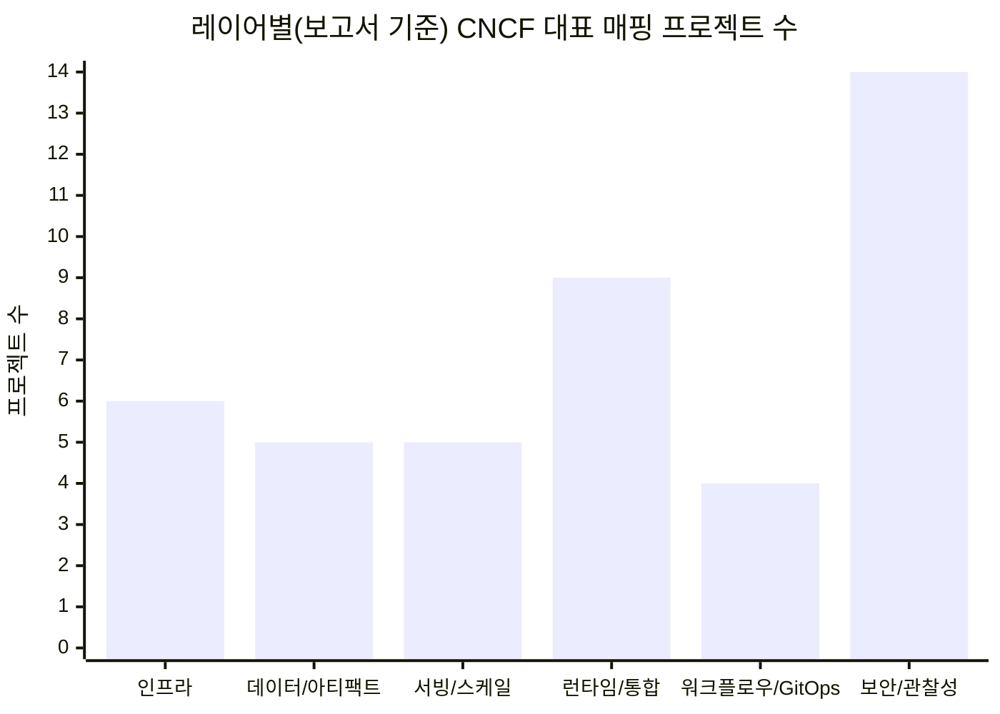

# CNCF 프로젝트 기반 AI 에이전트 플랫폼 아키텍처 레이어별 대표 기술 매핑 및 분석 보고서

본 보고서는 사용자가 특정 레이어 목록을 제공하지 않았으므로, 일반적인 “AI 에이전트 플랫폼(Agentic AI Platform)”을 구성하는 핵심 아키텍처 레이어를 먼저 정의한 뒤, 2026-03-13(Asia/Seoul)까지 공개된 CNCF 공식 프로젝트 목록(cncf.io/projects)에서 각 레이어에 대응하는 대표 프로젝트를 선별·매핑해 비교 분석한다. CNCF 프로젝트의 성숙도(Sandbox/Incubating/Graduated)는 운영 난이도·거버넌스·도입 리스크에 직접 영향을 미치므로, 본 보고서는 각 프로젝트의 CNCF 페이지/공식 문서/GitHub를 1차 근거로 삼아 장단점과 도입 고려사항을 구조화했다. 또한 “LLM 기반 에이전트 오케스트레이션(플래닝/툴선택/메모리)” 자체를 직접 제공하는 CNCF 프로젝트는 제한적이므로, 현실적인 플랫폼 구현 관점에서 **클라우드 네이티브 런타임·워크플로우·정책·관찰성·서빙** 빌딩블록을 중심으로 ‘조합 아키텍처’로 정리한다. CNCF는 최근 조사에서 Kubernetes가 AI 워크로드의 사실상 기반으로 자리잡았다고 강조하고 있어, 인프라 레이어는 Kubernetes 중심으로 분석한다. citeturn13search4turn9search1turn13search5turn14search16

## 분석 범위와 아키텍처 레이어 정의

### CNCF “등록”의 해석(범위 경계)
본 보고서에서 “CNCF에 등록된 프로젝트”는 **CNCF가 호스팅하는 프로젝트(Graduated/Incubating/Sandbox/Archived)** 로 한정한다. 이는 CNCF가 프로젝트별 페이지에서 수용(accepted) 시점과 성숙도 레벨을 명시하고, TOC 프로세스 문서가 “공식적으로 레벨 이동이 발표되지 않으면 incubating/graduated로 포함되지 않는다”고 규정하기 때문이다. citeturn9search1turn20search28turn14search16

### AI 에이전트 플랫폼을 위한 레이어 목록(사용자 제공 목록 부재 → 일반 모델 채택)
아래 6개 레이어는 (1) 에이전트 실행에 필요한 클라우드 네이티브 기반과 (2) RAG/툴실행/워크플로우/거버넌스 요구를 균형 있게 반영한 **일반적 레이어링**이다(불명확: 사용자가 합의한 고유 레이어 정의가 없으므로 표준적 범주로 제시). citeturn16search4turn13search5

1. **인프라·클러스터 오케스트레이션**: 컴퓨트/네트워크/컨테이너 실행/멀티클러스터 등, 에이전트·모델·도구 서비스를 배포·확장·격리하기 위한 기반 레이어. citeturn13search0turn10search6turn11search5turn11search1  
2. **데이터·아티팩트 저장/배포·검색**: 모델·프롬프트 템플릿·에이전트 패키지·도구 이미지·상태/메타데이터·대용량 파일의 저장과 배포 가속, (부분적으로) 조회/검색을 담당. citeturn20search0turn10search3turn20search3turn20search2turn20search5  
3. **모델 서빙·추론 및 스케일링**: LLM/임베딩/분류 등 추론 엔드포인트의 표준화·배포·오토스케일·서빙 데이터플레인 최적화 레이어. citeturn7search6turn21search3turn21search6  
4. **에이전트 런타임·통합·API Gateway**: 에이전트/툴 마이크로서비스 간 통신, 이벤트/메시징, API 게이트웨이/인그레스, (선택적으로) WASM 기반 안전 실행 등 통합 레이어. citeturn21search4turn4search2turn4search3turn12search4turn12search1turn12search3turn12search2  
5. **워크플로우·파이프라인·GitOps**: 에이전트 파이프라인(배치/스텝 기반), 운영 자동화, 모델/도구/정책 배포를 선언적으로 동기화하는 레이어. citeturn21search1turn7search0turn15search0turn15search1  
6. **보안·정책·관찰성**: ID/인증·인가, 정책집행, 공급망 보안, 런타임 위협탐지, 메트릭/트레이스/로그 수집·분석을 통한 운영 가시성 레이어. citeturn14search4turn6search15turn6search0turn6search9turn5search1turn5search0turn7search3turn14search1  

```mermaid
flowchart TB
  U[사용자/클라이언트] --> G[API Gateway/Ingress]
  G --> A[에이전트 서비스/툴 서비스]
  A --> W[워크플로우/파이프라인]
  A --> S[모델 서빙/추론]
  W --> S
  A --> D[(데이터/아티팩트 저장·배포)]
  S --> D

  subgraph INF[인프라·클러스터 오케스트레이션]
    K8S[Kubernetes 등]
  end
  INF --> G
  INF --> A
  INF --> W
  INF --> S
  INF --> D

  subgraph GOV[보안·정책·관찰성(횡단)]
    SEC[ID/정책/공급망/런타임 보안]
    OBS[메트릭/트레이스/로그]
  end
  SEC -.-> G
  SEC -.-> A
  SEC -.-> W
  SEC -.-> S
  OBS -.-> G
  OBS -.-> A
  OBS -.-> W
  OBS -.-> S
```

image_group{"layout":"carousel","aspect_ratio":"16:9","query":["CNCF projects landscape diagram","Kubernetes architecture diagram control plane worker nodes","KServe architecture inference service diagram","OpenTelemetry Collector pipeline diagram receivers processors exporters"],"num_per_query":1}

## 인프라·클러스터 오케스트레이션 레이어

### 대표 CNCF 프로젝트 매핑 표

| 프로젝트명 | 간단한 설명(한 문장) | 해당 레이어 핵심 역할/기능 | 장점(최소 2개) | 단점/제한사항(최소 2개) | 도입 고려사항(운영·보안·호환성) | 관련 링크(공식/GitHub) |
|---|---|---|---|---|---|---|
| entity["organization","Kubernetes","container orchestration"] | 컨테이너화된 워크로드의 배포·확장·관리를 자동화하는 오케스트레이션 플랫폼. citeturn13search0turn17search0 | AI 에이전트/모델/툴 서비스를 “기본 실행 기반”으로 스케줄링·오토힐·서비스 디스커버리·롤아웃 | (1) 컨트롤 플레인/워커 노드 분리로 확장 가능한 분산 운영 모델 citeturn17search0 <br>(2) 광범위한 생태계(서빙/관찰성/정책)와 결합이 용이 citeturn13search5 | (1) 구성요소가 많아(컨트롤 플레인/애드온) 운영 복잡도가 높아지기 쉬움 citeturn17search0turn17search8 <br>(2) GPU/AI 스케줄링의 고급 요구는 추가 컴포넌트가 필요(불명확: 선택 조합은 환경 의존) citeturn13search8 | (1) 멀티 AZ/HA 컨트롤 플레인 설계(관리형 vs 자체구축) citeturn17search24 <br>(2) 네트워크 정책/클러스터 경계/권한(RBAC) 표준화 <br>(3) 관찰성(OTel/Prometheus)과 정책(OPA/Kyverno) 동시 설계 | `https://kubernetes.io` / `https://github.com/kubernetes/kubernetes` |
| entity["organization","containerd","core container runtime"] | CRI 기반으로 컨테이너 수명주기(이미지/실행)를 관리하는 코어 컨테이너 런타임. citeturn6search36turn17search1 | Kubernetes 노드에서 실제 컨테이너 실행·이미지 풀·스냅샷/콘텐츠 저장소를 담당 | (1) 플러그인 구조(CRI, 스냅샷터 등)로 런타임 확장/최적화 가능 citeturn17search1turn17search9 <br>(2) Kubernetes CRI 경로에서 사실상 표준 런타임 중 하나로 운영 경험이 풍부(불명확: “사실상 표준”은 정량 기준이 환경별 상이) | (1) 런타임 레벨 문제는 진단 난이도가 높고 노드 운영에 직접 영향 citeturn17search17 <br>(2) CRI/런타임 구성(예: systemd cgroup 등) 오류가 장애로 직결될 수 있음 citeturn17search21 | (1) 노드 이미지/OS(커널, cgroup, SELinux 등)와의 정합성 <br>(2) 이미지 최적화(원격 스냅샷터 등)는 호환성 테스트 필요 citeturn17search9 | `https://containerd.io` / `https://github.com/containerd/containerd` |
| entity["organization","etcd","distributed key-value store"] | 분산 시스템의 핵심 데이터를 위한 고신뢰 키-값 저장소. citeturn10search0turn10search4 | Kubernetes 상태 저장(컨트롤 플레인 핵심 의존), 에이전트 플랫폼의 “클러스터 메타데이터 일관성” 기반 | (1) Raft 기반(일반적으로) 일관성 있는 저장소로 컨트롤 플레인 신뢰성에 기여(불명확: Raft 구현 세부는 버전/설정 의존) <br>(2) Kubernetes 운영에서 검증된 핵심 구성요소로 운용 지침이 축적 citeturn17search24turn17search4 | (1) 성능/용량/IOPS 한계가 곧 컨트롤 플레인 병목이 될 수 있음 citeturn17search24 <br>(2) 백업/복구·쿼럼 관리 실패 시 영향 범위가 큼(불명확: 구체적 RTO/RPO는 환경 의존) | (1) 백업/복구 절차, 디스크/스토리지 계층 신뢰성 <br>(2) etcd 모니터링(지연/리더 변경/디스크)과 장애훈련 | `https://etcd.io` / `https://github.com/etcd-io/etcd` |
| entity["organization","Cilium","ebpf networking"] | eBPF 기반 네트워킹/보안/관찰성을 제공하는 CNI 및 네트워크 스택. citeturn10search6turn10search2 | 에이전트/모델/툴 마이크로서비스 간 트래픽 제어, 네트워크 정책, L7 가시성(선택) | (1) eBPF 기반으로 네트워크·보안·관찰성을 통합적으로 제공 citeturn10search6 <br>(2) CNCF Graduated로 성숙도·운영사례 축적 citeturn10search2 | (1) 커널/eBPF 의존성으로 커널 버전·운영체제 제약이 발생할 수 있음(불명확: 지원 매트릭스는 릴리스별 상이) <br>(2) L7 기능/정책을 사용할수록 설계·튜닝 복잡도가 상승 | (1) 클러스터 네트워크 모델 및 기존 CNI 전환 전략 <br>(2) 네트워크 정책 표준화(제로 트러스트 포함) | `https://cilium.io` / `https://github.com/cilium/cilium` |
| entity["organization","Crossplane","infra control plane"] | 선언적 API로 인프라와 애플리케이션을 오케스트레이션하는 “클라우드 네이티브 컨트롤 플레인 프레임워크”. citeturn11search1turn11search0 | AI 플랫폼 인프라(클러스터/네임스페이스/클라우드 리소스) 프로비저닝과 가드레일을 Kubernetes API로 수렴 | (1) “플랫폼 팀이 제공하는 내부 플랫폼(Internal Platform)” API를 CRD로 모델링 가능 citeturn11search1 <br>(2) 멀티클라우드/하이브리드 오케스트레이션에 적합 citeturn11search1 | (1) 커스텀 API 설계(조직 표준) 역량이 필요하고 초기 설계 비용이 큼 citeturn11search1 <br>(2) 프로바이더/컴포지션 품질·버전 호환이 운영 리스크로 전이될 수 있음(불명확: 표준화 수준은 조직 성숙도 의존) | (1) “무엇을 Crossplane API로 노출할지” 범위 통제(과도한 추상화 방지) <br>(2) 정책(OPA/Kyverno)과 결합해 리소스 생성 가드레일 적용 | `https://www.crossplane.io` / `https://github.com/crossplane/crossplane` |
| entity["organization","Karmada","multi-cluster orchestration"] | 멀티클러스터/멀티클라우드 Kubernetes 오케스트레이션. citeturn11search5turn11search2 | 에이전트 플랫폼을 여러 클러스터(리전/클라우드)로 확장하고 정책 기반 스케줄링/페일오버 수행 | (1) 애플리케이션 변경 없이 멀티클러스터 운영을 목표로 설계 citeturn11search2 <br>(2) CNCF Incubating 단계로 기능 확장과 커뮤니티가 성장 중 citeturn11search5 | (1) 멀티클러스터로 인해 네트워크/ID/정책/관찰성 복잡도가 비선형 증가 citeturn11search2 <br>(2) 운영 표준(배포/업그레이드/DR) 정립이 선행되어야 효과가 큼 | (1) 클러스터 간 트러스트 모델(SPIFFE/SPIRE 등)·네트워크 연결 모델 <br>(2) 중앙 스케줄링 장애/지연에 대비한 운영 설계 | `https://karmada.io` / `https://github.com/karmada-io/karmada` |

### 심층 분석(대표 2개): Kubernetes, containerd

**Kubernetes(아키텍처)**  
Kubernetes 클러스터는 컨트롤 플레인(예: API 서버, 스케줄러, 컨트롤러 매니저, 상태 저장소 등)과 워커 노드 구성요소로 나뉘며, “원하는 상태(desired state)”를 지속적으로 수렴시키는 컨트롤 루프 기반 운영 모델을 전제로 한다. citeturn17search0turn17search12 이 구조는 에이전트 플랫폼에 중요한 두 가지 성질을 제공한다. 첫째, 에이전트/툴/모델 서빙을 Deployment/Job/CRD 등으로 선언하면, 인스턴스 장애나 노드 교체 시에도 자동 복구와 롤링 업데이트가 가능하다. 둘째, 스케일링·라우팅·정책·관찰성 등을 같은 API 표면(Kubernetes API)으로 통합할 수 있어, 운영 표준화를 통해 거버넌스 비용을 낮출 수 있다(불명확: 표준화 수준은 조직의 플랫폼 엔지니어링 성숙도에 의존). citeturn13search5turn17search0

**Kubernetes(배포 옵션/확장성·성능 특성)**  
배포는 크게 (1) 관리형 Kubernetes(EKS/GKE/AKS 등) 또는 (2) 자체 구축으로 나뉘며, 관리형은 컨트롤 플레인 HA/업그레이드 부담을 줄이는 반면, 자체 구축은 네트워크/보안/업그레이드 책임이 크게 증가한다. 관리형 EKS 예시만 보더라도 컨트롤 플레인이 API 서버 노드와 etcd 클러스터로 구성되어 다중 AZ로 내구성을 확보하는 설계를 설명한다. citeturn17search24 성능 관점에서 에이전트 플랫폼은 “짧은 요청(툴 호출)”과 “긴 요청(LLM 스트리밍/장시간 워크플로우)”이 혼재하므로, 오토스케일·큐잉·백프레셔를 상위 레이어(Serving/Workflow)에서 보완하는 것이 일반적이며, 이는 Kubernetes 단독 기능이라기보다 상위 빌딩블록(예: Knative/KEDA/KServe) 조합으로 달성된다. citeturn21search3turn21search6turn7search6

**containerd(아키텍처/운영 포인트)**  
containerd는 CRI 플러그인 등 플러그인 기반으로 런타임을 확장 가능하며, CRI 경로에서 “런타임 핸들러” 개념으로 다양한 런타임을 선택할 수 있다. citeturn17search1 또한 원격 스냅샷터(예: lazy pull) 같은 최적화 플러그인을 통해 이미지 풀/시작 지연을 줄이는 패턴이 존재하지만, 레지스트리/이미지 포맷/런타임 호환 검증이 필요하며 운영 난이도가 상승할 수 있다. citeturn17search9 에이전트 플랫폼처럼 배포 빈도와 이미지 다양성이 큰 환경에서는, 런타임/이미지 계층 최적화(아래 “Dragonfly+Harbor” 조합 등)와 함께 장애 진단 체계를 갖추는 것이 중요하다. citeturn17search17turn20search5turn20search0

## 데이터·아티팩트 저장/배포·검색 레이어

### 대표 CNCF 프로젝트 매핑 표

| 프로젝트명 | 간단한 설명(한 문장) | 해당 레이어 핵심 역할/기능 | 장점(최소 2개) | 단점/제한사항(최소 2개) | 도입 고려사항(운영·보안·호환성) | 관련 링크(공식/GitHub) |
|---|---|---|---|---|---|---|
| entity["organization","Rook","k8s storage orchestrator"] | Kubernetes 네이티브 스토리지 오케스트레이션(예: Ceph) 프로젝트. citeturn10search3turn10search10 | 에이전트/모델/툴 서비스가 사용하는 영속 스토리지(볼륨/오브젝트)를 클러스터 내에서 운영 | (1) 스토리지 운영을 Kubernetes 방식(오퍼레이터)으로 자동화 citeturn10search3 <br>(2) CNCF Graduated로 성숙도/운영 경험 축적 citeturn10search10 | (1) Ceph 등 백엔드 스토리지 특성 이해가 필요해 운영 난이도가 높을 수 있음(불명확: 난이도는 백엔드 선택/규모/장애 허용치 의존) <br>(2) 성능/비용 튜닝이 필수(스토리지 하드웨어/네트워크) | (1) 스토리지 장애 도메인(랙/AZ) 설계 <br>(2) 백업/복구(스냅샷, DR) 체계 및 IOPS/지연 SLA 정의 | `https://rook.io` / `https://github.com/rook/rook` |
| entity["organization","TiKV","distributed kv database"] | 분산 트랜잭션 키-값 데이터베이스. citeturn20search3turn20search6 | 에이전트 상태/메타데이터/고일관성 상태 저장(특히 분산 트랜잭션 요구 시) | (1) CNCF Graduated로 안정성/거버넌스 검증 citeturn20search3 <br>(2) 분산 트랜잭션/고가용성 지향(설계 목적) citeturn20search3 | (1) 운영 복잡도(노드/스토리지/컴팩션/리밸런싱 등)가 단일 DB보다 큼(불명확: 상세 운영 포인트는 배포 토폴로지 의존) <br>(2) “에이전트 메모리=벡터 검색” 요건에는 직접 대응 범위가 제한적(불명확: 벡터 인덱스/검색은 별도 스택이 일반적) citeturn16search4 | (1) 스토리지·네트워크 지연, 장애 복구 전략 <br>(2) 백업/스냅샷/업그레이드 절차 및 관찰성(메트릭/로그) | `https://tikv.org` / `https://github.com/tikv/tikv` |
| entity["organization","Vitess","mysql sharding"] | MySQL 호환을 유지하면서 수평 확장을 지원하는 클라우드 네이티브 DB 솔루션. citeturn20search2turn20search8 | 에이전트 플랫폼의 관계형 메타데이터(테넌트/권한/작업기록 등) 수평 확장 및 운영 자동화 | (1) MySQL 호환을 유지하면서 샤딩/클러스터링 제공 citeturn20search2 <br>(2) 다수 DB 인스턴스 운영/마이그레이션 등 대규모 운영 시나리오를 지향 citeturn20search19 | (1) 샤딩 설계/키 선택이 애플리케이션 모델에 영향(불명확: 최적 설계는 워크로드 의존) <br>(2) MySQL 단독 대비 구성요소가 증가해 운영 복잡도가 상승 | (1) 데이터 모델/샤딩키/트랜잭션 경계 설계 <br>(2) 백업/DR/스키마 변경(online DDL) 프로세스 확립 | `https://vitess.io` / `https://github.com/vitessio/vitess` |
| entity["organization","Harbor","oci registry"] | 컨테이너/OCI 아티팩트를 저장·서명·스캔하는 신뢰 레지스트리. citeturn20search0turn20search9 | 모델/에이전트/툴 이미지·OCI 아티팩트 저장소(“배포의 출처(Source of Artifacts)”) 역할 | (1) 취약점 스캐닝(Trivy/Clair 등)과 RBAC/감사 로그 등 보안 기능을 제공 citeturn17search2turn17search10turn20search0 <br>(2) CNCF Graduated로 성숙도 및 프로덕션 사용 사례 축적 citeturn20search9turn20search0 | (1) 고가용성/스토리지 백엔드 구성에 따라 운영 복잡도가 크게 달라짐(불명확) <br>(2) “레지스트리=단일 병목”이 되지 않도록 용량/대역폭/캐시 전략이 필요 | (1) 서명/스캔 정책을 CI/CD·배포 정책(OPA/Kyverno)과 연계 <br>(2) 멀티 사이트 복제/에어갭 환경 고려 시 리플리케이션 설계 citeturn17search10 | `https://goharbor.io` / `https://github.com/goharbor/harbor` |
| entity["organization","Dragonfly","p2p distribution"] | P2P 기반 이미지·파일 분산 배포/가속 시스템. citeturn20search5turn20search1 | 대규모 클러스터에서 모델/이미지 배포 가속(“pull 병목 완화”), 캐시·프리히트(사전 가열) | (1) Manager/Scheduler/Seed Peer/Peer로 구성되는 P2P 아키텍처로 대규모 배포 병목을 줄이는 데 초점 citeturn17search3turn20search5 <br>(2) Harbor와의 통합(예: P2P 프리히팅) 강화 흐름이 공식적으로 언급됨 citeturn17search23 | (1) 캐시 미스(처음 받는 아티팩트)에는 효과가 제한될 수 있음(불명확: 효과는 배포 패턴/재사용률 의존) <br>(2) Scheduler/Seed Peer 장애·튜닝이 성능에 직접 영향 citeturn17search7 | (1) 이미지/모델 배포 패턴 분석(재사용률, 동시 풀 폭주) 후 단계적 도입 <br>(2) registry 보안(RBAC/서명)과 P2P 경로 신뢰 모델 정립 | `https://d7y.io` / `https://github.com/dragonflyoss/Dragonfly2` |

### 심층 분석(대표 2개): Harbor, Dragonfly

**Harbor(아키텍처/배포 옵션)**  
Harbor는 “저장·서명·스캔”을 핵심 미션으로 하는 레지스트리로, CNCF 프로젝트 페이지에서 동 기능을 명시한다. citeturn20search0 취약점 스캐닝은 공식 문서에서 Trivy/Clair 기반 정적 분석을 제공한다고 설명하며, 설치 시 스캐너 활성화 옵션을 명시한다. citeturn17search2 또한 GitHub 설명은 레지스트리 복제(replication), 사용자 관리/접근제어/감사(auditing) 같은 운영·보안 기능을 강조한다. citeturn17search10 배포는 일반적으로 Kubernetes 위에 설치되며(불명확: 특정 설치 방식은 환경에 따라 Helm/Operator/매뉴얼 등 다양), 운영 핵심은 스토리지 백엔드(오브젝트/블록) 신뢰성과 HA 구성이다. citeturn20search0turn20search9

**Harbor(통합 포인트/운영적 함의)**  
AI 에이전트 플랫폼에서 Harbor는 단순 “컨테이너 이미지 저장소”를 넘어, 모델 서빙(예: KServe)과 에이전트/툴 서비스의 배포 아티팩트 출처를 통제하는 지점이 된다. 따라서 (1) 취약점 스캔 결과를 배포 정책 단계에서 차단하거나(정책 엔진과 연계), (2) 서명된 이미지/OCI 아티팩트만 프로덕션에 허용하는 식의 공급망 거버넌스 설계가 실무적으로 중요하다. citeturn17search2turn7search3turn14search1

**Dragonfly(아키텍처/확장성·성능 특성)**  
Dragonfly는 Manager/Scheduler/Seed Peer/Peer로 기능을 분리하고 P2P 네트워크를 구성하는 것이 공식 문서에서 명시된다. citeturn17search3turn17search7 이러한 구조는 “다수 노드가 동시에 큰 아티팩트를 pull하면서 레지스트리/네트워크가 병목”이 되는 경우에 특히 유효하며, CNCF 발표는 Dragonfly가 컨테이너 및 AI 모델 분산에 초점을 둔 이미지/파일 배포 시스템임을 설명한다. citeturn20search1turn20search5

**Dragonfly(배포 옵션/통합 포인트)**  
CNCF 블로그는 Dragonfly가 Harbor와의 통합을 강화하며 P2P 프리히팅(사전 캐시) 등 기능을 개선했다고 언급한다. citeturn17search23 따라서 실무에서는 (1) Harbor를 “신뢰 원본”, (2) Dragonfly를 “대규모 배포 가속 캐시/분산 레이어”로 두고, 배포 파이프라인(Argo/Flux)에서 버전 롤아웃 시 캐시 프리히트를 자동화하는 패턴이 자연스럽다(불명확: 구체 구현은 조직 CI/CD 구조 의존). citeturn21search1turn7search0turn17search23

## 모델 서빙·추론 및 스케일링 레이어

### 대표 CNCF 프로젝트 매핑 표

| 프로젝트명 | 간단한 설명(한 문장) | 해당 레이어 핵심 역할/기능 | 장점(최소 2개) | 단점/제한사항(최소 2개) | 도입 고려사항(운영·보안·호환성) | 관련 링크(공식/GitHub) |
|---|---|---|---|---|---|---|
| entity["organization","KServe","ai inference platform"] | Kubernetes에서 예측·생성형 AI 추론을 표준화해 배포하는 분산 추론 플랫폼. citeturn7search6turn18search8 | LLM/예측 모델 추론 엔드포인트(InferenceService) 표준화, 서빙 데이터플레인 제공 | (1) CNCF 프로젝트 페이지에서 “스케일러블·멀티프레임워크 추론 플랫폼”으로 정의 citeturn7search6 <br>(2) InferenceService가 predictor/transformer/explainer 구성을 지원(전/후처리·설명가능성) citeturn18search12 | (1) 백엔드(모델 서버), 네트워킹/스케일링(예: Knative) 등 의존 컴포넌트 조합에 따라 복잡도가 커짐(불명확) citeturn7search6 <br>(2) GPU/토큰 기반 최적화 등 고급 서빙은 추가 설계가 필요(불명확: 워크로드·기술 선택 의존) citeturn7search33 | (1) 모델 패키징/버전 전략(레지스트리·스토리지)과 연계 citeturn20search0turn10search3 <br>(2) 관찰성(요청 지연/토큰/오류) 수집 설계(OTel/Prometheus) | `https://kserve.github.io/website/` / `https://github.com/kserve/kserve` |
| entity["organization","Knative","serverless platform"] | Kubernetes 위에서 서버리스·이벤트 기반 애플리케이션을 위한 플랫폼. citeturn21search3turn21search7 | 추론 서버(컨테이너)의 scale-to-zero, 라우팅, 이벤트 전달 기반 제공 | (1) 요청 플로우에서 Activator/Autoscaler/Queue-Proxy 등으로 scale-to-zero 및 라우팅을 지원 citeturn18search5turn18search1 <br>(2) 2025년 Graduated로 성숙도/운영 신뢰성 강화 citeturn21search3turn21search7 | (1) “콜드 스타트/스케일 투 제로” 특성은 LLM 스트리밍·지연 민감 워크로드에서 튜닝이 필요(불명확) citeturn18search5 <br>(2) 네트워킹 레이어(예: Contour/Istio/Kourier) 선택에 따라 운영 복잡도 차이 citeturn18search13 | (1) 추론 서비스는 scale-to-zero 정책을 신중히 적용(지연/비용 균형) <br>(2) 인그레스/게이트웨이 표준화와 관찰성 메트릭 연계 citeturn18search21turn12search4 | `https://knative.dev` / `https://github.com/knative` |
| entity["organization","KEDA","event autoscaling"] | 이벤트 기반으로 Kubernetes 워크로드를 자동 확장하는 컴포넌트. citeturn21search6turn21search11 | 큐 길이/이벤트 소스 기반 에이전트 작업자·툴 실행자·비동기 추론 워커 확장 | (1) CNCF 페이지에서 이벤트 기반 오토스케일 구성요소로 명시 citeturn21search6 <br>(2) HPA와 공존하며 “특정 워크로드만 이벤트 기반 확장”이 가능하다고 공식 사이트가 설명 citeturn21search15 | (1) 스케일러(외부 시스템) 의존성이 커질수록 인증/가용성 설계가 중요 citeturn21search11 <br>(2) 과도한 스케일링/스파이크에 대한 레이트리밋·쿼터 설계가 필요(불명확) | (1) 이벤트 소스별 인증(Secret/Key) 관리와 정책 연동 <br>(2) 워크로드 우선순위/쿼터(멀티테넌시) 설계 | `https://keda.sh` / `https://github.com/kedacore/keda` |
| entity["organization","Kubeflow","ml platform on k8s"] | Kubernetes 기반 ML 워크플로우/플랫폼(학습·실험·파이프라인)을 제공하는 프로젝트. citeturn3search3turn16search7 | (에이전트 플랫폼 관점) 모델 라이프사이클/학습·실험 파이프라인과의 연계 지점 | (1) CNCF Incubating으로 플랫폼 단위 ML 구성요소를 제공(범위가 넓음) citeturn3search3 <br>(2) “Kubernetes에서 ML 워크플로우를 배포”라는 지향이 CNCF 트렌드 논의에서 언급 citeturn16search7 | (1) 에이전트 플랫폼에 비해 MLOps 범위가 넓어 과도 도입 위험(불명확: 조직 요구에 따라 상이) <br>(2) 구성요소 조합이 방대하여 최소구성(MVP) 정의가 필수 | (1) 에이전트 플랫폼이 “서빙 중심”인지 “학습/실험 포함”인지 범위 결정(불명확) <br>(2) KServe 등과 역할 중복/분리 기준 설정 citeturn14search27 | `https://www.kubeflow.org` / `https://github.com/kubeflow/kubeflow` |
| entity["organization","Volcano","batch scheduler"] | Kubernetes에서 배치/HPC/AI 워크로드를 위한 스케줄링 확장 프로젝트. citeturn3search0turn13search33 | GPU/대규모 배치 추론·전처리 작업(큐/우선순위/갱스케줄링 등) 지원(불명확: 기능 적용 범위는 세부 설정 의존) | (1) AI/HPC 배치 스케줄링 요구를 목표로 함 citeturn13search33 <br>(2) 표준 Kubernetes 스케줄링의 한계를 보완하는 방향의 생태계로 언급 citeturn13search31 | (1) 클러스터 스케줄링 계층이 하나 더 늘어 운영 복잡도 증가 <br>(2) 기존 잡/큐 시스템과의 역할 충돌 가능(불명확) | (1) GPU 공유/쿼터/우선순위 정책부터 정의 <br>(2) 멀티테넌시에서 공정성/비용정산 모델 설계(불명확) | `https://volcano.sh` / `https://github.com/volcano-sh/volcano` |

### 심층 분석(대표 2개): KServe, Knative

**KServe(아키텍처)**  
KServe는 “컨트롤 플레인-데이터 플레인” 관점에서 추론 실행을 분리해 설명하며, 데이터 플레인이 예측/생성/변환/설명 수행을 담당한다고 명시한다. citeturn18search16 또한 KServe의 CRD API는 InferenceService가 predictor(필수), transformer/explainer(선택)로 구성될 수 있음을 명확히 하며, transformer가 전/후처리를 담당하고 explainer가 설명 서비스를 담당한다고 기술한다. citeturn18search12 이 구조는 에이전트 플랫폼에서 **(1) 프롬프트/컨텍스트 구성(전처리), (2) 모델 호출, (3) 출력 후처리** 를 한 파이프라인으로 표준화하는 데 유리하다(불명확: 실제 파이프라인 설계는 모델·도메인별 상이). citeturn18search12turn16search4

**KServe(배포 옵션/확장성)**  
KServe는 Kubernetes 기반 배포를 전제로 하며, 실제 오토스케일/라우팅 계층은 Knative 같은 서버리스 계층과 결합되는 경우가 많다(불명확: 모든 배포가 Knative를 필요로 하는지 여부는 구성에 따라 상이). 이를 전제로 하면, 서빙 확장성은 (1) 서빙 인스턴스 자동 확장, (2) 트래픽 라우팅, (3) 요청/토큰 처리 전략 등으로 구성되며, CNCF 발표/세션은 LLM 인퍼런스 스케일의 주제로 KServe를 다루고 있다. citeturn7search33turn21search3  
한국어 자료 측면에서, entity["company","Red Hat","enterprise linux vendor"] 블로그는 KServe가 CNCF Incubating으로 수용되었음을 한국어로 설명해 도입 배경을 확인하는 데 도움이 된다. citeturn7search10

**Knative(요청 플로우/성능 특성)**  
Knative Serving의 요청 플로우 문서는 HTTP 라우터→(선택)Activator→Queue-Proxy→사용자 컨테이너로 이어지는 경로를 도식화하고, autoscaler/activator 등이 “클러스터 레벨 공유 리소스”로 동작해 서비스가 사용되지 않을 때 오버헤드를 줄일 수 있다고 설명한다. citeturn18search5 또한 Serving 아키텍처 문서는 Queue-Proxy가 사이드카로서 메트릭 수집과 동시성 제어를 수행한다고 기술한다. citeturn18search1  
에이전트 플랫폼 관점에서 Knative는 “툴 실행 워커”나 “단기 추론 엔드포인트”에 scale-to-zero를 적용해 비용 효율을 높일 수 있으나, 콜드 스타트/동시성 제한/큐잉 정책은 사용자 경험(특히 대화형 LLM)과 직결되므로, 지연 SLO를 먼저 정의한 뒤 범위를 제한적으로 적용하는 접근이 합리적이다(불명확: 최적 파라미터는 워크로드 의존). citeturn18search5turn18search21

## 에이전트 런타임·통합·API Gateway 레이어

### 대표 CNCF 프로젝트 매핑 표

| 프로젝트명 | 간단한 설명(한 문장) | 해당 레이어 핵심 역할/기능 | 장점(최소 2개) | 단점/제한사항(최소 2개) | 도입 고려사항(운영·보안·호환성) | 관련 링크(공식/GitHub) |
|---|---|---|---|---|---|---|
| entity["organization","Dapr","distributed app runtime"] | 사이드카 기반으로 분산 애플리케이션 빌딩블록(상태/통신/워크플로우 등)을 제공하는 런타임. citeturn21search4turn18search10 | 에이전트/툴 서비스 간 호출, pub/sub, 상태 저장, 워크플로우 등 ‘에이전트 실행 빌딩블록’ 제공 | (1) 사이드카 패턴으로 HTTP/gRPC API를 제공해 언어/프레임워크 결합도를 낮춤 citeturn18search22turn18search14 <br>(2) 워크플로우 빌딩블록은 SDK→사이드카 gRPC 스트림으로 등록/실행 구조를 문서화 citeturn18search2 | (1) 빌딩블록 구성요소(state/pubsub 등) 선택과 백엔드(예: Redis, Kafka 등) 매핑이 필요(불명확: 백엔드 표준은 조직 의존) <br>(2) 사이드카 추가로 네트워크 홉/운영 컴포넌트가 늘어남 | (1) “플랫폼 팀이 표준 컴포넌트 템플릿 제공” 형태로 운영하는 것이 바람직(불명확) <br>(2) 서비스 간 mTLS/정책/관찰성과의 통합(Envoy/OPA/OTel) 설계 | `https://dapr.io` / `https://github.com/dapr/dapr` |
| entity["organization","Envoy","service proxy"] | 동적 구성(xDS) 기반의 고성능 서비스 프록시/데이터 플레인. citeturn4search2turn18search7 | API Gateway/서비스 메시 데이터 플레인, L7 라우팅/리트라이/서킷브레이커, 관찰성/보안 필터 | (1) xDS를 통해 Listener/Route/Cluster 등 구성 리소스를 동적으로 배포 citeturn18search7turn18search3 <br>(2) 다수 게이트웨이/메시/인그레스(Contour/Emissary)에서 표준 프록시로 활용 citeturn12search4turn12search1 | (1) 구성 모델이 방대해 운영·디버깅 난이도가 높을 수 있음 citeturn18search7turn18search35 <br>(2) 컨트롤 플레인(구성 분배) 없이는 대규모 운영 효익이 제한(불명확) | (1) Gateway/Ingress 표준과 RBAC/OIDC 연동(Keycloak 등) 사전 정의 citeturn14search0 <br>(2) 레이트리밋/인증/감사 요구를 필터·정책 엔진과 결합 | `https://www.envoyproxy.io` / `https://github.com/envoyproxy/envoy` |
| entity["organization","NATS","messaging"] | 클라우드 네이티브 메시징/이벤트 전송(스트리밍 포함)을 제공하는 시스템. citeturn4search3 | 에이전트 이벤트 버스, 비동기 툴 실행, 작업 큐(워크플로우 이벤트) | (1) CNCF 페이지 기준 “Streaming & Messaging” 범주의 핵심 프로젝트로 자리 citeturn4search3 <br>(2) wasmCloud 등 다른 CNCF 프로젝트 생태계와 결합 사례가 존재 citeturn12search11 | (1) 메시지 내구성/재처리/정확히 한 번 처리 등 보장 수준은 구성·패턴에 의존(불명확) <br>(2) 멀티테넌시/권한 모델을 설계하지 않으면 “전사 이벤트 버스”가 보안 리스크가 될 수 있음 | (1) 토픽/스트림 네이밍·권한·암호화 정책 표준화 <br>(2) 관찰성(지연/드랍/컨슈머 랙) 운영 지표 정의 | `https://nats.io` / `https://github.com/nats-io/nats-server` |
| entity["organization","CloudEvents","event specification"] | 이벤트 데이터를 표준 형식으로 기술하기 위한 명세(스펙). citeturn4search5turn9search20 | 에이전트/워크플로우/툴 실행 이벤트의 상호운용성 확보(벤더/플랫폼 간) | (1) CNCF Graduated(명세 성숙)로 상호운용성 기반 제공 citeturn9search20 <br>(2) 이벤트 기반 시스템(NATS/Knative Eventing 등)과 결합 시 계약(Contract) 표준화에 유리(불명확: 조직마다 이벤트 스키마 요구 상이) | (1) 스펙만으로는 “런타임”이 아니며, 전송/저장/검증 체계가 별도 필요 <br>(2) 도메인 이벤트 스키마 관리(버전업/호환성)가 추가 과제 | (1) 이벤트 스키마 레지스트리/검증 파이프라인(불명확: CNCF 내 표준 선택은 제한적) <br>(2) 보안(PII/권한) 기준을 이벤트 모델에 반영 | `https://cloudevents.io` / `https://github.com/cloudevents/spec` |
| entity["organization","gRPC","rpc framework"] | 고성능 RPC 프레임워크(다양한 언어/환경에서 동작). citeturn4search4 | 에이전트-툴 서비스 간 내부 API 계약(IDL), 스트리밍(토큰/이벤트) 통신 | (1) 강타입 IDL 기반으로 내부 서비스 계약을 명확히 하고 코드 생성 지원(불명확: 언어별 툴링 편차) <br>(2) Envoy/서비스 메시 환경에서 L7 트래픽으로 관찰·정책 적용이 용이 citeturn18search7turn4search2 | (1) 외부 공개 API로는 REST/OIDC 생태계와의 브리지가 필요할 수 있음 <br>(2) 운영 시 리트라이/타임아웃/스트리밍 처리 등 분산시스템 설계가 필수 | (1) API 게이트웨이(Envoy 계열)에서 외부 프로토콜 변환 전략 <br>(2) 관찰성(OTel)과 결합해 트레이싱/메트릭 표준화 | `https://grpc.io` / `https://github.com/grpc/grpc` |
| entity["organization","Contour","ingress controller"] | Envoy 기반 Kubernetes 인그레스 컨트롤러. citeturn12search4turn12search12 | 에이전트/서빙 엔드포인트의 외부 진입점(HTTP/TLS), 멀티테넌트 인그레스 위임 | (1) Envoy 엣지/서비스 프록시의 컨트롤 플레인을 제공 citeturn12search8turn12search12 <br>(2) Knative 네트워킹 레이어 옵션 중 하나로 언급됨 citeturn18search13 | (1) API Gateway 요구(인증/레이트리밋/WAF)에 따라 별도 구성 필요(불명확) <br>(2) 인그레스 표준/CRD(HTTPProxy 등) 학습 필요(불명확) | (1) 인증(OIDC/Keycloak)·정책(OPA/Kyverno)·관찰성 연계 <br>(2) TLS 자동화(cert-manager)와 결합해 운영 표준화 citeturn6search24turn14search0 | `https://projectcontour.io` / `https://github.com/projectcontour/contour` |
| entity["organization","Emissary-Ingress","api gateway"] | Envoy 기반 Kubernetes 네이티브 API 게이트웨이/인그레스. citeturn12search1turn12search5 | 에이전트 플랫폼 외부 API 게이트웨이(인증/라우팅/관찰성), 마이크로서비스 인그레스 | (1) CNCF 페이지에서 “Envoy 기반 API gateway”로 명시 citeturn12search1 <br>(2) GitHub는 개발자 중심(self-service) 게이트웨이 목표를 설명 citeturn12search9 | (1) 게이트웨이 정책이 늘수록 Envoy 구성/운영 복잡도 상승(불명확) <br>(2) 멀티테넌시에서 인증/권한/레이트리밋 설계가 필수 | (1) 인증(토큰), 권한(OpenFGA/OPA)과의 결합 지점 정의 <br>(2) 게이트웨이 로그/메트릭/트레이스 표준화(OpenTelemetry) citeturn19search2turn14search7 | `https://www.getambassador.io/products/emissary-ingress` / `https://github.com/emissary-ingress/emissary` |
| entity["organization","wasmCloud","webassembly platform"] | 다양한 환경에서 WebAssembly 컴포넌트를 빌드·관리·스케일링하는 플랫폼. citeturn12search3turn12search15 | 에이전트 툴(플러그인) 실행을 컨테이너보다 경량/이식성 높은 컴포넌트로 운영(불명확: 조직 채택 패턴 다양) | (1) CNCF Incubating 프로젝트로 Wasm 컴포넌트 운영을 목표 citeturn12search3turn12search15 <br>(2) GitHub는 Kubernetes/edge 등 다양한 환경을 주제로 설명 citeturn12search11 | (1) 컨테이너 기반 생태계 대비 운영 표준/툴체인이 성숙하지 않은 영역이 있을 수 있음(불명확) <br>(2) 기존 네트워크/보안/관찰성 표준과의 통합이 추가 과제 | (1) “어떤 툴을 Wasm으로 격리 실행할지” 범위 정의 <br>(2) 메시징(NATS) 및 정책/관찰성 결합 검증 citeturn12search11turn4search3 | `https://wasmcloud.com` / `https://github.com/wasmCloud/wasmCloud` |
| entity["organization","WasmEdge Runtime","webassembly runtime"] | 클라우드 네이티브/엣지 환경용 고성능 WebAssembly 런타임. citeturn12search2turn12search22 | (선택) 에이전트 플러그인/샌드박스 실행(특히 사용자 제공 코드/확장) | (1) CNCF Sandbox로 초기/실험 영역의 런타임 기술을 제공 citeturn12search2 <br>(2) 문서가 “잘 정의된 실행 샌드박스/격리”를 핵심으로 설명 citeturn12search22 | (1) Sandbox 성숙도 특성상 장기 지원/운영 표준은 조직이 보완해야 할 수 있음 citeturn14search20 <br>(2) 컨테이너 대비 생태계 도구(디버깅/관찰성) 성숙도 차이(불명확) | (1) 보안 격리 목적(플러그인 실행)과 운영 비용을 비교 <br>(2) 컨테이너 기반 배포 표준과 병행 운영 전략 | `https://wasmedge.org` / `https://github.com/WasmEdge/WasmEdge` |

### 심층 분석(대표 2개): Dapr, Envoy

**Dapr(아키텍처/배포 옵션)**  
Dapr는 “애플리케이션 옆에 Dapr 사이드카(daprd)가 붙는(sidecar) 구조”를 핵심 개념으로 설명하며, 애플리케이션 코드에 런타임 내부 코드를 직접 포함하지 않아도 된다고 명시한다. citeturn18search22turn18search14 워크플로우 빌딩블록은 애플리케이션이 Workflow SDK로 워크플로우를 작성하면 SDK가 사이드카와 gRPC 스트림으로 연결되어 등록/활동(activity) 태스크를 스케줄링하는 모델을 문서화한다. citeturn18search2 배포는 Kubernetes/VM/엣지 등 다양한 방식이 가능하나(불명확: 조직별 표준 플랫폼에 따라 상이), 에이전트 플랫폼에서는 Kubernetes 상에서 “표준 컴포넌트 템플릿(상태 저장소, pub/sub, secrets)”을 운영팀이 제공하고 개발팀이 이를 조합해 에이전트를 구현하는 패턴이 가장 현실적이다. citeturn21search4turn18search10

**Dapr(확장성·성능 특성/통합 포인트)**  
Dapr 통신은 사이드카↔사이드카 경로로 흐르며(서비스 디스커버리 포함), 이 구조는 재시도/회로차단/관찰성 같은 분산시스템 관심사를 공통 계층으로 끌어올리는 데 유리하다. citeturn18search34 다만 사이드카 추가는 홉 증가와 운영 대상 증가를 의미하므로, (1) 추론 호출(고부하)과 (2) 툴 호출(짧은 요청)의 트래픽 특성에 따라 적용 범위를 분리하는 것이 합리적이다(불명확). 또한 Dapr 워크플로우 트레이싱은 OTel과의 결합이 실무적으로 중요하다는 논의가 존재한다. citeturn18search30turn19search2

**Envoy(xDS 기반 운영 모델)**  
Envoy는 xDS 동적 구성 API를 통해 Listener→RouteConfiguration→Cluster→ClusterLoadAssignment 같은 리소스를 연결해 라우팅을 구성하는 모델을 공식 문서에서 제시한다. citeturn18search7turn18search3 이는 API Gateway 또는 서비스 메시 환경에서 “정책/라우팅/리트라이” 같은 기능을 중앙에서 배포하기 용이하게 하지만, 반대로 구성 리소스 모델이 복잡해 디버깅 부담이 커질 수 있으며, Istio 문서도 디버깅을 위해 clusters/listeners/routes/endpoints 상호작용 이해가 필요하다고 언급한다. citeturn18search35turn18search7  
에이전트 플랫폼에서는 LLM 엔드포인트(서빙)와 툴 서비스(내부 마이크로서비스)를 게이트웨이 계층에서 분리하고, 인증·레이트리밋·감사·관찰성을 일관되게 적용하는 것이 핵심 통합 포인트가 된다(불명확: 조직 보안 요구에 따라 상이). citeturn12search5turn14search0turn19search2

## 워크플로우·파이프라인·GitOps 레이어

### 대표 CNCF 프로젝트 매핑 표

| 프로젝트명 | 간단한 설명(한 문장) | 해당 레이어 핵심 역할/기능 | 장점(최소 2개) | 단점/제한사항(최소 2개) | 도입 고려사항(운영·보안·호환성) | 관련 링크(공식/GitHub) |
|---|---|---|---|---|---|---|
| entity["organization","Argo","gitops workflows"] | Kubernetes 네이티브 워크플로우·클러스터 관리·GitOps 도구 모음. citeturn21search1turn21search5 | 에이전트/모델/툴 배포 자동화(GitOps), 배치 워크플로우 실행(Workflows), 이벤트 기반 자동화(Events) | (1) CNCF 페이지에서 GitOps·워크플로우 도구로 정의 citeturn21search1 <br>(2) Argo CD는 API 서버가 인증/RBAC/웹훅 등을 담당한다고 아키텍처 문서에 명시 citeturn19search9 | (1) GitOps 범위가 넓어질수록(멀티클러스터/멀티테넌시) 권한/정책 설계가 복잡 citeturn19search9 <br>(2) 대규모 환경에서 repo-server/캐시/동시성 튜닝이 필요(불명확: 튜닝 방식은 사용 패턴 의존) | (1) 선언적 배포 표준(Helm/Kustomize/OCI) 확정 <br>(2) OIDC(예: Keycloak)와 결합해 SSO·권한 위임 citeturn19search9turn14search0 | `https://argo-cd.readthedocs.io` / `https://github.com/argoproj` |
| entity["organization","Flux","gitops cd"] | GitOps Toolkit 기반의 Kubernetes 지속적 전달(CD) 솔루션. citeturn7search0turn7search8 | 선언적 동기화(클러스터 상태를 Git/OCI 소스와 일치), 에이전트 플랫폼 컴포넌트 배포 자동화 | (1) 여러 컨트롤러(Source/Kustomize/Helm/Notification 등)로 분리된 마이크로서비스 아키텍처를 공식 문서가 설명 citeturn19search0 <br>(2) CNCF Graduated로 성숙도 확보 citeturn7search0 | (1) 컨트롤러 분할 구조로 인해 구성요소 이해가 필요(불명확) citeturn19search0 <br>(2) GitOps 정책(승인/배포 창/롤백)를 조직 프로세스에 맞게 설계해야 함 | (1) Git을 단일 진실 소스(SSOT)로 운영할 조직 프로세스 확립 <br>(2) Harbor 등 OCI 레지스트리와의 결합 시 권한/서명 정책 정합성 citeturn20search0turn19search0 | `https://fluxcd.io` / `https://github.com/fluxcd/flux2` |
| entity["organization","KubeVela","application platform"] | OAM 기반 “모던 애플리케이션 플랫폼”으로, 워크플로우 기반 앱 전달 모델을 제공. citeturn15search0turn19search1 | 에이전트/툴/서빙 컴포넌트를 ‘애플리케이션 단위’로 추상화하고 워크플로우형 전달/운영 자동화 | (1) Kubernetes 위에서 CRD 컨트롤 플레인으로 동작하며 OAM 모델을 제공 citeturn19search1turn19search15 <br>(2) 워크플로우 엔진이 CUE 기반 스텝을 번역/실행한다는 설명이 존재 citeturn19search11 | (1) OAM/정의(Definition) 모델 도입으로 기존 Kubernetes 사용자에겐 추상화 비용이 발생 citeturn19search27 <br>(2) 조직 표준 컴포넌트/트레잇 설계 역량이 없으면 “추상화만 늘어나는” 위험(불명확) | (1) 플랫폼 팀/서비스 팀 역할 분리(정의/템플릿 관리 vs 앱 개발) <br>(2) 정책(OPA/Kyverno)과 통합해 정의 수준에서 가드레일 적용 | `https://kubevela.io` / `https://github.com/kubevela/kubevela` |
| entity["organization","Serverless Workflow","workflow dsl spec"] | 서버리스 워크플로우 DSL(도메인 특화 언어) 명세를 제공하는 프로젝트. citeturn15search1turn15search12 | 에이전트 파이프라인을 워크플로우 DSL로 기술해 런타임 간 상호운용성 확보(불명확: 런타임 선택은 별도) | (1) CNCF Sandbox로 표준(명세) 중심의 상호운용성 자산 제공 citeturn15search1 <br>(2) SDK/런타임(예: Synapse) 등 생태계를 제공한다는 GitHub 설명 citeturn15search12 | (1) Sandbox 성숙도: 프로덕션 표준화는 조직이 검증/보완 필요 citeturn14search20 <br>(2) 명세 도입만으로 운영 자동화가 완성되지는 않음(실행 런타임/관찰성 필요) | (1) “워크플로우 정의”와 “실행 런타임”을 분리해 선정 <br>(2) 이벤트 표준(CloudEvents)과 결합 시 효과가 큼 citeturn4search5turn15search12 | `https://serverlessworkflow.io` / `https://github.com/serverlessworkflow` |

### 심층 분석(대표 2개): Argo, KubeVela

**Argo(아키텍처/배포 옵션/운영 사례 요약)**  
Argo는 CNCF 프로젝트 페이지에서 GitOps·워크플로우 도구 모음으로 정의되며, 2022-12-06에 Graduated로 이동한 것이 명시된다. citeturn21search1turn21search5 특히 Argo CD 아키텍처 문서는 API 서버가 애플리케이션 관리, 리포지토리/클러스터 자격증명 관리(Secret 저장), 인증/외부 IdP 위임, RBAC 집행, Git 웹훅 이벤트 리스너 등을 담당한다고 구체적으로 기술한다. citeturn19search9 이는 에이전트 플랫폼에서 “모델/툴/정책 배포를 선언적으로 관리”할 때 가장 중요한 운영 포인트(자격증명, RBAC, 웹훅 기반 배포 트리거)가 Argo CD에 내장되어 있음을 의미한다. 또한 CNCF는 2025년 조사에서 Argo CD 채택 비중을 언급하며(정량 수치 포함), 시장 채택이 높음을 시사한다. citeturn21search21

**KubeVela(아키텍처/통합 포인트)**  
KubeVela는 OAM(Open Application Model)을 기반 모델로 하며, Kubernetes 위에서 CRD 컨트롤러로 동작하는 “컨트롤 플레인”임을 문서가 명시한다. citeturn19search1turn19search15 또한 워크플로우 엔진이 CUE 기반 스텝을 번역해 실행하며, 독립 엔진/내장 엔진 형태로 동작할 수 있다는 설명이 존재한다. citeturn19search11  
에이전트 플랫폼 관점에서 KubeVela의 가치가 큰 지점은 “플랫폼 팀이 제공하는 애플리케이션 전달 모델(컴포넌트/정책/트레잇)”을 통해, 에이전트 구성요소(툴 서비스, 서빙 서비스, 라우팅, 관찰성)를 재사용 가능한 모듈로 제공할 수 있다는 점이다(불명확: 실제 조직 적용은 플랫폼 운영 성숙도 의존). citeturn19search15turn15search7

## 보안·정책·관찰성 레이어

### 대표 CNCF 프로젝트 매핑 표

| 프로젝트명 | 간단한 설명(한 문장) | 해당 레이어 핵심 역할/기능 | 장점(최소 2개) | 단점/제한사항(최소 2개) | 도입 고려사항(운영·보안·호환성) | 관련 링크(공식/GitHub) |
|---|---|---|---|---|---|---|
| entity["organization","Keycloak","iam sso"] | OIDC/OAuth2 등 표준 프로토콜 기반 IAM(인증·인가) 솔루션. citeturn14search4turn14search0 | 사용자/개발자/서비스의 SSO, API 보호(토큰), IdP 표준화 | (1) CNCF 블로그가 “중앙 인증/인가, Kubernetes 배포 용이”를 명시 citeturn14search0 <br>(2) Prometheus 메트릭 제공 및 CNCF 생태계 통합을 언급 citeturn14search0 | (1) 엔터프라이즈 IdM 연동(AD/LDAP)과 테넌시 설계가 필요(불명확) <br>(2) 토큰/세션/키 관리가 보안 중심 운영 과제가 됨 | (1) Argo/게이트웨이/내부 API의 OIDC 표준화 <br>(2) 관리자 권한 분리·감사 로그·2FA 정책 확정 citeturn14search0turn19search9 | `https://www.keycloak.org` / `https://github.com/keycloak/keycloak` |
| entity["organization","SPIFFE","workload identity spec"] | 워크로드 ID 표준(프레임워크)로 제로 트러스트 기반을 제공. citeturn6search3turn6search7 | 서비스/에이전트/툴 워크로드에 안전한 ID 발급·검증(표준) | (1) CNCF Graduated로 성숙도 확보 citeturn6search7turn6search3 <br>(2) 워크로드 ID 표준화로 다중 런타임/클러스터 간 트러스트 모델 기반 제공 citeturn6search3 | (1) 표준 자체는 구현이 필요(SPIRE 등) citeturn6search15 <br>(2) 기존 PKI/서비스 메시와 통합 설계가 필요(불명확) | (1) 멀티클러스터(Karmada) 확장 시 워크로드 ID 표준화가 특히 중요 citeturn11search5turn6search3 | `https://spiffe.io` / `https://github.com/spiffe/spiffe` |
| entity["organization","SPIRE","spiffe runtime"] | SPIFFE를 구현하는 워크로드 ID 발급/검증 런타임 환경. citeturn6search15turn6search7 | 워크로드 인증서/토큰 발급, 서비스 간 mTLS/신원 검증 토대 | (1) CNCF 프로젝트 페이지가 Graduated 및 수용/승격 이력을 명시 citeturn6search15 <br>(2) 제로 트러스트 워크로드 ID 구현체로 표준 기반 운영 가능 citeturn6search7 | (1) 운영 컴포넌트 추가(서버/에이전트)로 배포·업그레이드 복잡도 증가 <br>(2) 정책/인가(OPA/OpenFGA 등)와 별개로 “인증”에 집중(역할 분리 필요) | (1) 인증서 수명/회전/장애시나리오 정의 <br>(2) 서비스 메시/게이트웨이/에이전트 런타임과의 통합 테스트 | `https://spiffe.io/spire` / `https://github.com/spiffe/spire` |
| entity["organization","Open Policy Agent","policy engine"] | Rego 기반 범용 정책 엔진(Policy-as-Code). citeturn6search34turn6search12 | 에이전트 툴 접근 권한, 배포 정책, 데이터 접근 정책 등 ‘외부화된 정책 집행’ | (1) CNCF 발표로 Graduated(2021) 성숙도 확보 citeturn6search12 <br>(2) 공식 문서가 정책 언어/개념을 제공 citeturn6search34 | (1) 정책 데이터 분배/캐시/동기화는 추가 아키텍처 요소(불명확) <br>(2) 정책 품질(테스트/리뷰) 없이는 운영 리스크(차단/우회) 증가 | (1) “정책 스코프”를 단계적으로 확대(배포→런타임→데이터) <br>(2) CI에서 정책 테스트/검증 파이프라인 구축 | `https://www.openpolicyagent.org` / `https://github.com/open-policy-agent/opa` |
| entity["organization","Kyverno","k8s policy"] | Kubernetes 네이티브 정책 엔진(주로 Admission/정책 자동화). citeturn5search23turn8search15 | 배포 리소스 검증/변형, 보안 가드레일(예: 이미지 서명/스캔 결과 기반) | (1) Kubernetes 리소스(정책 CRD) 중심으로 정책을 운영하는 접근을 지원 citeturn8search15 <br>(2) CNCF 생태계에서 Tekton 등 파이프라인과 결합한 정책 기반 접근 사례가 논의됨(불명확: Tekton은 CNCF 프로젝트가 아님) citeturn8search15turn9search24 | (1) 정책이 많아질수록 성능·관리 복잡도 증가 가능(불명확) <br>(2) 범용 정책(OPA) 대비 표현력/적용 범위 차이를 검토해야 함(불명확) | (1) OPA와 역할 분담(배포 정책 vs 런타임 정책) 결정 <br>(2) 정책 변경 승인 프로세스(거버넌스) 수립 | `https://kyverno.io` / `https://github.com/kyverno/kyverno` |
| entity["organization","cert-manager","cert automation"] | Kubernetes에서 TLS 인증서 발급/갱신을 자동화하는 프로젝트. citeturn6search10turn6search24 | 인그레스/게이트웨이/내부 mTLS에 필요한 인증서 운영 자동화 | (1) CNCF 발표로 Graduated(2024) 성숙도 확보 citeturn6search10 <br>(2) 공식 발표/프로젝트 공지에서 감사(audit) 수행 등 보안 성숙을 강조 citeturn6search24turn6search18 | (1) CA/ACME/내부 PKI 선택 및 키 관리가 핵심 운영 과제 <br>(2) 인증서 만료/회전 실패는 대규모 장애로 이어질 수 있음(불명확) | (1) Keycloak/SPIRE/게이트웨이와 인증서 체계 정합성 <br>(2) 인증서 수명 정책/알림/런북 구축 | `https://cert-manager.io` / `https://github.com/cert-manager/cert-manager` |
| entity["organization","in-toto","supply chain framework"] | 소프트웨어 공급망 무결성을 강화하는 보안 프레임워크. citeturn7search3turn7search7 | 모델/에이전트/툴 아티팩트의 빌드→배포 체인 무결성(서명된 메타데이터) | (1) CNCF Graduated(2025)로 공급망 보안 프레임워크 성숙도 확보 citeturn7search7turn7search3 <br>(2) “공급망 무결성”을 직접 목표로 하는 전용 프레임워크 citeturn7search11 | (1) 체인 오브 트러스트를 조직 CI/CD에 실제로 녹여야 효과(도입 비용) <br>(2) 기존 서명/검증 체계와의 역할 중복/정합성 검토 필요(불명확) | (1) Harbor/배포 정책과 결합해 정책 기반 “검증된 아티팩트만 배포” 구현 <br>(2) 감사/규제 요구사항에 맞는 증적 모델 설계 | `https://in-toto.io` / `https://github.com/in-toto/in-toto` |
| entity["organization","The Update Framework (TUF)","secure updates"] | 소프트웨어 업데이트 시스템을 보호하는 보안 프레임워크(레퍼런스 구현). citeturn14search1turn14search9 | 레지스트리/업데이트/배포 경로에서 롤백·키 탈취 등 공격에 대한 방어 설계 | (1) CNCF 프로젝트 페이지에서 Graduated(2019)로 명시 citeturn14search1 <br>(2) 공식 사이트가 “업데이트 시스템 보호 프레임워크” 목적을 설명 citeturn14search9 | (1) 적용 대상이 “업데이트/배포 시스템”이며, 도입하려면 시스템 설계 변경이 필요 <br>(2) 조직별 공급망 구조가 다르므로 표준 적용 범위가 불명확할 수 있음 | (1) 컨테이너/모델 아티팩트 배포 경로에 TUF 패턴 적용 가능성 검토(불명확) <br>(2) in-toto와 역할 분담(서명 메타데이터 vs 업데이트 보호) | `https://theupdateframework.io` / `https://github.com/theupdateframework/python-tuf` |
| entity["organization","Kubescape","k8s security"] | 클러스터/매니페스트/이미지 등을 스캔하는 보안·컴플라이언스 플랫폼. citeturn14search6turn14search2 | 에이전트 플랫폼 클러스터 보안 상태/취약점/하드닝 정책 점검 | (1) CNCF 페이지에서 “클러스터/매니페스트/레지스트리/이미지 스캔” 범위를 명시 citeturn14search6 <br>(2) CNCF Incubating으로 단계 이동 이력을 제공 citeturn14search6 | (1) 스캔 결과를 실제 배포 차단/수정으로 연결하려면 운영 프로세스가 필요 <br>(2) 오탐/정책 튜닝 없이는 개발 속도를 저해할 수 있음(불명확) | (1) GitOps/CI 파이프라인(Argo/Flux)과 통합해 “shift-left” 적용 <br>(2) 결과 기반 예외/승인 프로세스 정의 | `https://kubescape.io` / `https://github.com/kubescape/kubescape` |
| entity["organization","Falco","runtime security"] | 커널 이벤트 기반 런타임 위협 탐지(쿠버네티스 위협 탐지 엔진) 프로젝트. citeturn6search9turn6search13 | 에이전트/툴 실행 워크로드의 런타임 이상행위 탐지(침해·오용) | (1) CNCF 페이지가 2024-02-29 Graduated로 이동했다고 명시 citeturn6search9 <br>(2) 런타임 보안(위협 탐지) 전용 도구로 역할이 명확 citeturn6search13 | (1) 룰 튜닝/오탐 관리가 필수(운영 부담) <br>(2) 탐지 이후 대응(자동 격리/차단)은 별도 체계 필요(불명확) | (1) 경보→사고 대응 런북/자동화(워크플로우) 연계 <br>(2) eBPF/커널 모듈 환경 제약 검토(불명확) | `https://falco.org` / `https://github.com/falcosecurity/falco` |
| entity["organization","OpenTelemetry","observability standard"] | 텔레메트리(트레이스/메트릭/로그) 수집·전송 표준 및 생태계. citeturn5search1turn19search2 | 에이전트 호출 체인(툴/모델) 관찰, 성능·비용·신뢰성 운영 지표 표준화 | (1) Collector가 수신→처리→전송 파이프라인으로 텔레메트리를 다룬다고 공식 문서가 설명 citeturn19search2turn19search5 <br>(2) 벤더 중립 파이프라인으로 여러 백엔드로 전송 가능 citeturn19search2 | (1) “무엇을 계측할지(스팬/attributes)” 표준이 없으면 데이터 폭증/비용 상승 가능(불명확) <br>(2) 샘플링/PII 마스킹 등 정책이 미비하면 보안 리스크 | (1) 게이트웨이/서빙/워크플로우 전 구간에 공통 트레이싱 컨벤션 정의 <br>(2) Collector 배치 패턴(Agent/Gateway)와 보안(토큰) 설계 | `https://opentelemetry.io` / `https://github.com/open-telemetry/opentelemetry-collector` |
| entity["organization","Prometheus","metrics monitoring"] | 메트릭 수집·저장·알림을 위한 시계열 모니터링 시스템. citeturn5search0turn5search4 | 에이전트/서빙/클러스터 메트릭 기반 오토스케일, SLO 모니터링 | (1) CNCF Graduated로 생태계 표준 메트릭 스택 형성 citeturn5search0turn5search4 <br>(2) 다양한 프로젝트가 Prometheus 메트릭 노출을 기본 통합으로 제공 citeturn14search0 | (1) 장기 보관/고가용성은 추가 설계(Thanos/Cortex 등) 필요(불명확: 본 보고서 범위는 대표프로젝트 중심) <br>(2) 카드inality 폭증(라벨 설계) 위험 | (1) 메트릭 모델(라벨, SLO) 표준화 <br>(2) KEDA/Knative/KServe 등 스케일러와 메트릭 연계 검증 citeturn21search6turn18search5turn7search6 | `https://prometheus.io` / `https://github.com/prometheus/prometheus` |
| entity["organization","Jaeger","distributed tracing"] | 분산 트레이싱 시스템(호출 흐름/병목 분석). citeturn5search2turn5search4 | 에이전트의 멀티툴 호출·서빙 체인 트레이스 수집/분석 백엔드 | (1) CNCF Graduated로 성숙도 확보 citeturn5search2 <br>(2) OpenTelemetry 등과 결합 가능한 트레이싱 생태계 구성요소로 널리 사용 citeturn19search5 | (1) 트레이스 저장/샘플링/보관 정책 설계 없이는 비용 급증 가능(불명확) <br>(2) OTel 기반 전환/혼재 환경에서 마이그레이션 설계 필요(불명확) | (1) OTel Collector를 통한 수집 표준화 후 백엔드 선택(Jaeger 포함) <br>(2) 에이전트 응답 지연 분석에 필요한 태그/스팬 컨벤션 정의 | `https://www.jaegertracing.io` / `https://github.com/jaegertracing/jaeger` |
| entity["organization","Fluentd","log collector"] | 다양한 소스의 로그를 수집·변환·전송하는 통합 로그 파이프라인. citeturn5search3turn5search4 | 에이전트 실행 로그/툴 호출 로그/감사 로그 수집 및 중앙 전송 | (1) CNCF Graduated로 표준 로그 레이어로 널리 활용 citeturn5search3turn5search4 <br>(2) 다양한 플러그인/출력으로 스토리지/분석계와 연동 용이(불명확: 플러그인 품질은 다양) | (1) 로그 스키마/PII 마스킹/보관 정책 부재 시 리스크(보안/비용) <br>(2) 대규모에서는 Fluent Bit 등 경량 수집기와 역할 분담 필요(불명확: 본 보고서 범위는 대표 프로젝트 중심) | (1) 에이전트 감사/추론 입력데이터(민감정보) 처리 정책을 로그 파이프라인에 반영 <br>(2) OTel 로그 파이프라인과의 역할 정합성 검토 | `https://www.fluentd.org` / `https://github.com/fluent/fluentd` |
| entity["organization","OpenFGA","fine grained auth"] | Google Zanzibar에서 영감을 받은 고성능 세분화 권한(authorization) 시스템. citeturn14search7turn14search3 | RAG/툴/데이터 접근에서 “사용자별·리소스별” 세분화 인가(ABAC/관계 기반) 구현 | (1) CNCF Incubating으로 성숙도 상승(2025-10-28) 이력 제공 citeturn14search7 <br>(2) RAG 기반 시스템에서 “권한 외 데이터 노출” 리스크를 줄이는 구조적 접근(인가 외부화)과 결합 가능 citeturn16search14 | (1) 권한 모델링(관계/튜플 설계) 자체가 난이도가 높을 수 있음(불명확) <br>(2) 정책(OPA/Kyverno)과 역할 중복이 아니라 “인가 데이터” 영역 분담이 필요 | (1) Keycloak(인증)과 OpenFGA(인가) 분리 설계 <br>(2) 에이전트 메모리/RAG 검색 결과 필터링 지점에 인가 체크 삽입 citeturn16search14turn14search0 | `https://openfga.dev` / `https://github.com/openfga/openfga` |

### 심층 분석(대표 2개): Open Policy Agent, OpenTelemetry

**OPA(정책 엔진으로서의 위치)**  
OPA는 CNCF 발표로 Graduated(2021)이며, 정책을 코드로 정의하는 policy-as-code 접근을 강조한다. citeturn6search12turn6search34 AI 에이전트 플랫폼에서 정책이 필요한 지점은 크게 세 가지다. (1) 배포 정책(어떤 이미지/모델만 배포 가능한가), (2) 런타임 정책(어떤 툴/API 호출이 허용되는가), (3) 데이터 정책(RAG 결과로 어떤 문서를 노출 가능한가). 이때 OPA 자체는 “정책 평가 엔진”이므로, 정책 데이터(예: 사용자/테넌트 권한) 분배·캐시·동기화(그리고 감사 가능성)를 별도 설계해야 한다(불명확: 표준 아키텍처는 조직·규모에 따라 다양). citeturn6search34turn16search14

**OpenTelemetry(콜렉터 파이프라인 기반 관찰성)**  
OpenTelemetry Collector는 텔레메트리를 “수신(receive)→처리(process)→전송(export)”하며, 이를 파이프라인으로 구성한다고 공식 문서에 명시한다. citeturn19search2turn19search5 에이전트 플랫폼에서 특히 중요한 이유는, 단일 사용자 요청이 (1) 게이트웨이, (2) 에이전트, (3) 여러 툴 서비스, (4) 모델 서빙(KServe/Knative), (5) 데이터 저장소를 연쇄 호출하며 지연·오류가 누적되기 때문이다. 따라서 “분산 트레이싱”과 “요청 단위 코스트/지연”을 추적하려면, 공통 스팬 컨벤션(예: tool.name, model.name, tenant.id 등)을 정의하고 Collector에서 샘플링/PII 마스킹/라우팅을 표준화해야 한다(불명확: 구체 컨벤션은 조직 요구 의존). citeturn16search14turn19search2turn7search6

## 결론: 레이어별 추천과 도입 로드맵

### 레이어별 권장 조합(초급·중급·대규모 환경)
아래 추천은 “CNCF 성숙도(Graduated 우선) + 운영 복잡도 + 에이전트 플랫폼에서의 범용성”을 기준으로 한 실무적 권장이다(불명확: 조직의 기존 표준/인력/규제가 없으므로 ‘일반론’으로 제시). citeturn14search16turn13search5

| 레이어 | 초급(소규모/파일럿) | 중급(프로덕션/멀티팀) | 대규모(멀티테넌시/멀티클러스터) |
|---|---|---|---|
| 인프라·클러스터 | Kubernetes(+관리형) 중심, containerd 기본 citeturn13search0turn17search24 | Cilium로 네트워크 정책 강화, etcd 운영 표준화 citeturn10search6turn10search0 | Crossplane(플랫폼 API) + Karmada(멀티클러스터)로 확장 citeturn11search1turn11search5 |
| 데이터·아티팩트 | Harbor(사설 레지스트리) + Rook(기본 스토리지) citeturn20search0turn10search3 | Vitess 또는 TiKV로 상태 저장 확장(필요 시) citeturn20search2turn20search3 | Dragonfly로 대규모 모델/이미지 배포 병목 완화 citeturn20search5turn20search1 |
| 모델 서빙·추론 | Knative(+KEDA)로 워커/툴 scale-to-zero, 필요 시 KServe 도입 citeturn21search3turn21search6turn7search6 | KServe 중심의 표준 추론(전/후처리 포함), 관찰성 표준화 citeturn18search12turn19search2 | KServe+정교한 스케줄/캐시(불명확) + 정책 기반 멀티테넌시(OPA/OpenFGA) citeturn6search34turn14search7turn7search33 |
| 런타임·통합·게이트웨이 | Envoy 기반 인그레스(Contour/Emissary 중 1) + CloudEvents 계약(선택) citeturn12search4turn12search1turn4search5 | Dapr로 서비스 호출/워크플로우 빌딩블록 표준화 citeturn21search4turn18search2 | NATS 이벤트 버스 + wasmCloud/WasmEdge로 플러그인 격리 실행(선택) citeturn4search3turn12search3turn12search2 |
| 워크플로우·GitOps | Flux 또는 Argo CD 중 하나로 GitOps 도입 citeturn7search0turn21search1 | Argo(Workflows/Events 포함)로 파이프라인 확장 citeturn21search1turn21search5 | KubeVela로 앱 전달 모델 표준화(플랫폼 팀 역량 전제) citeturn15search0turn19search1 |
| 보안·정책·관찰성 | Keycloak(SSO) + Prometheus/OTel(기본 관찰성) citeturn14search0turn5search0turn19search2 | OPA(정책) + cert-manager(TLS) + Falco(탐지) citeturn6search12turn6search10turn6search9 | SPIFFE/SPIRE(워크로드 ID) + OpenFGA(세분화 인가) + in-toto/TUF(공급망) citeturn6search7turn14search7turn7search7turn14search1 |

### 단계별 도입 로드맵(체크리스트·우선순위)
| 단계 | 목표 | 우선순위 체크리스트(간단) |
|---|---|---|
| 기반 정립 | 실행 기반과 배포 표준 확립 | Kubernetes 표준 구성(네임스페이스/리소스쿼터/RBAC) citeturn17search0turn19search9 · 레지스트리(Harbor) 구축 및 스캔/서명 정책 초안 citeturn20search0turn17search2 |
| 서빙·통합 MVP | “에이전트+툴+모델 호출” 최소 경로를 운영 가능하게 | API Gateway/Ingress(Contour 또는 Emissary) 선택 citeturn12search4turn12search1 · KServe 또는 Knative로 추론 엔드포인트 표준화 citeturn7search6turn18search5 · 이벤트 계약(CloudEvents) 도입 여부 결정 citeturn4search5 |
| 거버넌스 강화 | 보안/정책/관찰성의 “플랫폼 공통 레이어” 구축 | Keycloak로 인증 표준화(OIDC) citeturn14search0 · OPA/Kyverno로 배포 가드레일(정책-as-code) citeturn6search34turn8search15 · OTel Collector 파이프라인 설계(샘플링/PII) citeturn19search2 |
| 대규모 확장 | 멀티테넌시/멀티클러스터/대용량 배포 최적화 | Dragonfly로 아티팩트 배포 병목 완화 citeturn20search1turn20search5 · SPIFFE/SPIRE로 워크로드 ID 표준화 citeturn6search7turn6search15 · OpenFGA로 세분화 인가(특히 RAG) citeturn14search7turn16search14 · Karmada/Crossplane로 확장 운영 체계 수립 citeturn11search5turn11search1 |

### 레이어별 매핑 프로젝트 수 비교(본 보고서 선정 기준)
아래 비교는 “본 보고서에서 각 레이어에 대표로 매핑한 CNCF 프로젝트 수”이며, CNCF 전체 프로젝트 수나 시장 점유율을 의미하지 않는다(불명확: 사용자에게 전체 프로젝트 분포 비교 요구가 없으므로, 보고서 내 매핑 범위로 한정). citeturn9search1

| 레이어 | 매핑한 프로젝트 수 |
|---|---:|
| 인프라·클러스터 오케스트레이션 | 6 |
| 데이터·아티팩트 저장/배포·검색 | 5 |
| 모델 서빙·추론 및 스케일링 | 5 |
| 에이전트 런타임·통합·API Gateway | 9 |
| 워크플로우·파이프라인·GitOps | 4 |
| 보안·정책·관찰성 | 14 |

