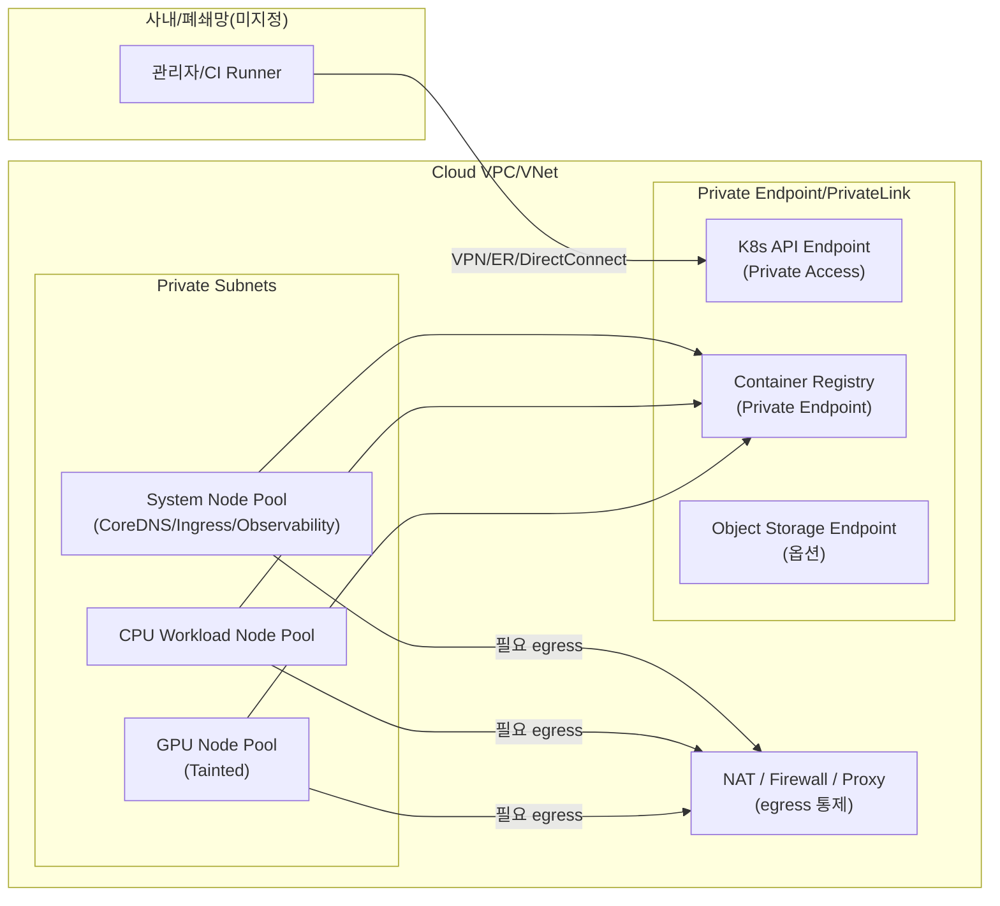

# 멀티 환경 Kubernetes·GPU 인프라 레이어 정의서

## Executive Summary

본 정의서는 **AWS / Azure / On‑prem / Private‑cloud** 환경에서 **Kubernetes + GPU 노드**를 **설계·구성·운영**하기 위한 **Infra Layer 표준**을 실무 수준으로 정리한다. 핵심 목표는 (1) 네트워크·보안 경계가 명확한 **프라이빗(또는 제한적) 클러스터 토폴로지**, (2) GPU 드라이버/런타임/플러그인/스케줄링/오토스케일링이 표준화된 **GPU 데이터 플레인**, (3) 스토리지 성능·가용성·비용을 “워크로드 특성”에 맞춰 선택하는 **CSI 기반 영구 스토리지 계층**, (4) GitOps 기반 배포와 관측/백업/업그레이드가 체계화된 **운영 체계**의 확립이다. citeturn1search4turn1search3turn3search8turn4search0turn5search2turn8search0

실무 우선순위는 다음 6개를 **P0(필수)**로 둔다.  
(1) **클러스터 API 엔드포인트 프라이빗화**(EKS private access / AKS private cluster 등) citeturn1search4turn1search3  
(2) **송신(egress) 경로의 명시적 설계**(NAT/Firewall/Private Endpoint/UDR/차단)와 정책 기반 통제 citeturn15search1turn15search5turn15search2turn7search5turn7search11  
(3) **GPU 노드 표준 이미지/드라이버/런타임 + Device Plugin(또는 GPU Operator) 표준화** citeturn0search15turn0search1turn3search1turn3search12turn9search0  
(4) **GPU 노드 풀 분리 + taints/tolerations + affinity로 스케줄링 강제** citeturn0search3turn0search7turn20search6  
(5) **CSI 기반 PV 표준(성능/IOPS·스냅샷·복구 포함)** citeturn4search0turn4search12turn4search5turn4search17  
(6) **관측(메트릭/로그/알림) + 백업/복구 + 업그레이드 런북의 운영 표준화** citeturn6search8turn6search3turn8search3turn8search1turn8search2

가장 큰 리스크는 세 가지다.  
첫째, **GPU 드라이버/쿠버네티스 버전/컨테이너 런타임/Operator 간 호환성 불일치**(업그레이드 시 장애). citeturn8search0turn3search8turn3search10  
둘째, **egress 경로 미정/불투명**으로 인한 보안 감사 실패·데이터 유출·업데이트 불가. citeturn15search1turn15search2turn15search5  
셋째, **Spot/저장소 성능·비용 모델**을 GPU 워크로드 특성에 맞게 설계하지 못해 비용 폭증 또는 처리량 붕괴. citeturn11search1turn11search2turn12search2turn12search7turn16view1

## 목적, 적용범위, 전제

### 목적

Infra Layer 관점에서 **Kubernetes 클러스터와 GPU 데이터 플레인**을 일관된 기준으로 설계·구성·운영하기 위한 표준 정의를 제공한다. 본 문서는 특정 프로젝트의 상세 설계서가 아니라, 멀티 환경에 공통 적용 가능한 **표준(Standards) + 권장(Recommendations) + 체크리스트**에 해당한다. citeturn4search0turn3search12turn8search13

### 적용범위

포함 범위는 다음과 같다.

- 환경: AWS(관리형 K8s), Azure(관리형 K8s), On‑prem(베어메탈 중심), Private‑cloud(가상화/프라이빗 IaaS 등)  
- 구성요소: VPC/VNet/서브넷/라우팅, Private Endpoint/PrivateLink, NAT 및 egress 통제, CSI 기반 PV/공유 파일시스템, GPU 드라이버·런타임·MIG/공유, 스케줄링(taints/affinity) 및 오토스케일링(HPA/VPA/KEDA/Cluster Autoscaler), IAM/RBAC/암호화, 관측(Prometheus/Grafana·로그·알림), GitOps(Argo CD/Flux), 백업·복구, 업그레이드 전략, IaC 예시. citeturn15search1turn4search5turn3search0turn2search0turn2search3turn5search2turn5search3turn8search0

### 전제

아래 항목은 사용자 요구에 의해 “미지정”으로 둔다(설계 시 반드시 확정 필요).

| 항목 | 값 | 비고 |
|---|---:|---|
| 목표 리전/리소스 위치 | 미지정 | egress/Private Endpoint/비용에 직접 영향 |
| Kubernetes 버전(컨트롤플레인/노드) | 미지정 | 버전 스큐 정책 준수 필요 citeturn8search0 |
| GPU 종류(A100/H100 등), MIG 필요 여부 | 미지정 | MIG 가능 여부·드라이버 최소 버전 영향 citeturn3search2turn3search10 |
| GPU 워크로드 유형(학습/추론/배치) | 미지정 | 노드풀·오토스케일·스토리지 선택 결정 |
| 네트워크 격리 수준(완전 차단/프록시 경유/부분 허용) | 미지정 | AKS outboundType·Firewall/UDR/VPC Endpoint 설계 필요 citeturn15search0turn7search5 |
| SLO(지연/가용성), RTO/RPO | 미지정 | 모니터링·백업·DR 설계에 반영 |

실무적으로는, “미지정” 항목을 확정하기 전까지는 **(1) API 엔드포인트 프라이빗화 + (2) egress 경로 명시 + (3) GPU 노드풀 분리**를 최소 기준으로 잡는 것이 안전하다. citeturn1search4turn1search3turn15search1turn0search3

## 레퍼런스 아키텍처 패턴

아키텍처 패턴은 “관리형(K8s as a Service)”과 “자체 운영(온프렘/프라이빗클라우드)”로 크게 나뉘며, 공통적으로 **Control Plane 접근 경계 + Data Plane(노드/Pod) 경계 + Egress 경계 + Storage 경계**를 분리한다. citeturn1search4turn1search3turn15search1turn4search0

### 관리형 클러스터 표준 패턴

다음 패턴은 AWS·Azure에서 공통적으로 적용 가능한 기준 토폴로지다.



- EKS는 클러스터 API 서버 엔드포인트에 대해 **private access 활성화 및 public access 제한/비활성화**를 지원한다. citeturn1search4turn1search0turn1search8  
- AKS는 **Private Link 기반 프라이빗 클러스터** 구성을 지원하며 API 서버 접근을 프라이빗으로 만든다. citeturn1search3turn1search19  
- 레지스트리(예: Azure Container Registry)는 Private Link로 **공용 인터넷 노출을 제거**하고, 프라이빗 DNS 구성이 중요하다. citeturn13search5turn13search7  

### 인터넷 egress 최소화 또는 무(無) egress 패턴

보안·규제 또는 데이터 유출 통제 요구가 강한 경우, “완전 차단” 또는 “허용 리스트 기반” 송신 정책이 필요하다.

- AWS 측면에서 “아웃바운드 인터넷이 없는” EKS 구성은 **VPC Endpoint 기반으로 AWS 서비스 접근을 대체**하는 방향으로 안내된다. citeturn7search0turn7search4turn7search5turn7search13  
- Azure 측면에서 AKS는 egress를 **load balancer / NAT gateway / user-defined routing**으로 구성할 수 있으며, 일부 시나리오에서는 **outbound type `block`(프리뷰)**처럼 egress를 적극 차단하는 옵션도 존재한다. citeturn15search0turn15search4turn15search1  

특히 AKS는 2026-03-31부터 “기본 아웃바운드 액세스” 관련 변경이 공지되어 있어(문서 기준), **클러스터 송신 경로를 명시적으로 설계**해야 한다. citeturn15search4

## 설계·구성 표준

### 네트워크

#### 네트워크 분리 원칙

네트워크 분리는 최소 4계층으로 정의한다.

1) **관리 평면(관리자/CI) → K8s API**: 사내망 또는 보안접속(VPN/전용회선)에서만 API 접근 허용  
2) **컨트롤플레인 ↔ 노드/Pod 데이터 플레인**: 클러스터 내부 통신 경계 정의  
3) **동서(East‑West) 트래픽**: Namespace/서비스 간 통신을 NetworkPolicy로 최소권한화  
4) **남북(North‑South)/송신(Egress)**: NAT/Firewall/Proxy/Private Endpoint로 통제하고 감사 가능하게 구성 citeturn1search4turn1search3turn10search3turn15search1turn15search2  

#### AWS 권장 구성

- VPC/Subnet: EKS는 클러스터 생성 시 **VPC와 최소 2개(서로 다른 AZ)의 서브넷**을 요구한다(환경별 상세는 별도 설계 확정 필요). citeturn7search12  
- Pod 네트워킹: EKS는 VPC CNI를 통해 Pod가 VPC 네트워크 상의 IP를 갖는 구조를 제공한다(운영 정책/주소계획에 직접 영향). citeturn1search17  
- Pod 단위 보안그룹: EKS는 VPC CNI에서 `ENABLE_POD_ENI=true` 등을 통해 **security groups for pods**(Pod 별 SG) 기능을 제공한다(서비스 간 세밀한 L3/L4 제어에 유리). citeturn1search1turn1search9turn1search5  
- Kubernetes NetworkPolicy: EKS는 VPC CNI와 결합한 NetworkPolicy 구성을 안내하며, 적용 가능 범위(예: EC2 Linux 노드 등)에는 제약이 있다. citeturn1search13turn10search15  
- Private Endpoint/PrivateLink: 컨테이너 이미지 풀을 인터넷 없이 수행하려면, 예를 들어 Amazon ECR은 **interface VPC endpoint(AWS PrivateLink)**를 제공하며 인터넷 게이트웨이·NAT 없이도 트래픽이 AWS 네트워크에 머문다. citeturn7search5turn7search13  
- NAT/방화벽 egress: 프라이빗 서브넷의 아웃바운드 인터넷 트래픽은 NAT gateway로 제공할 수 있다. citeturn15search14 또한 중앙 egress에서 트래픽을 검사/필터링하려면 NAT와 함께 **AWS Network Firewall** 같은 구성이 소개된다. citeturn15search2turn15search6  

#### Azure 권장 구성

- Private cluster: AKS 프라이빗 클러스터는 Private Link 기반으로 배포할 수 있다. citeturn1search3  
- Egress 유형: AKS는 egress를 **load balancer / NAT gateway / user-defined routing** 등으로 구성하며, 환경에 따라 egress 차단(outbound type `block`, 프리뷰) 옵션도 존재한다. citeturn15search0turn15search1turn15search4  
- NAT gateway: Azure NAT Gateway는 대량의 아웃바운드 흐름(포트) 요구를 처리하기 위한 스케일 특성이 문서화되어 있으며(load balancer egress 대비 제약 언급 포함), AKS egress 설계에서 주요 선택지다. citeturn15search8turn7search2  
- NetworkPolicy: AKS는 NetworkPolicy로 Pod 간 통신을 통제할 수 있고, 정책 엔진 옵션(Cilium/Azure NPM/Calico)을 비교하면서 Cilium(eBPF 기반)을 권장하는 설명이 있다. citeturn7search11turn7search7  
- 레지스트리 Private Endpoint: ACR은 Private Link로 프라이빗 엔드포인트를 구성해 공용 인터넷 노출을 제거하고, 프라이빗 DNS 설정이 핵심이다. citeturn13search5turn13search7  
- 방화벽 기반 egress 통제: AKS는 아웃바운드/FQDN 규칙을 활용해 Azure Firewall로 egress 트래픽을 제어하는 가이드를 제공한다. citeturn15search1turn15search5  

#### On‑prem / Private‑cloud 권장 구성

온프렘/프라이빗클라우드는 “플랫폼 기능 차이”가 크므로 네트워크 표준은 다음 두 줄로 고정한다.

- **Kubernetes 표준 NetworkPolicy + (가능 시) eBPF 기반 엔진(Cilium 등)으로 동서 트래픽 최소권한** citeturn10search3turn15search7turn15search3  
- **egress는 L7 프록시/보안장비/방화벽 경유를 강제**하고, 외부 목적지는 허용 리스트(도메인/FQDN 또는 IP)로 관리한다(엔진별 기능 제약은 별도 검증). citeturn15search3turn15search1  

### 스토리지

#### 표준 개념

- Kubernetes는 애플리케이션이 노드 수명주기와 독립적으로 데이터를 유지하도록 **PersistentVolume(PV)/PersistentVolumeClaim(PVC)** 개념을 제공한다. citeturn4search0turn14search10  
- 스토리지 클래스(StorageClass)는 클러스터 운영자가 제공하는 스토리지 등급(QoS/백업/정책)을 표현하는 표준 메커니즘이다. citeturn4search12  
- CSI(Container Storage Interface)는 Kubernetes 핵심 코드 변경 없이 스토리지 플러그인을 배포·개선할 수 있게 하는 표준이며, AKS는 CSI로 Azure Disks/Files/Blob 등의 영구 스토리지를 사용할 수 있다고 설명한다. citeturn4search17turn4search3  

#### AWS 권장 구성

- 블록 스토리지: Amazon EBS CSI Driver는 EKS Add-on으로 설치하는 것을 권장(보안/운영 부하 완화)한다. citeturn4search5turn4search16  
- 공유 파일 스토리지: EKS는 Amazon EFS CSI Driver로 공유 파일 시스템을 사용하는 절차를 제공한다. citeturn4search6turn4search13  
- 성능/IOPS 기준(예시): EBS 볼륨 타입은 gp3/gp2/io1/io2 등을 제공하며, 표준 문서에 최대 IOPS/Throughput·제약이 정리되어 있다(예: gp3는 대규모 성능 스케일링 가능). citeturn16view1  
- 비용 모델: gp3는 **기본 성능(예: 3,000 IOPS 및 125 MB/s)**이 포함되고 추가 IOPS/Throughput을 독립적으로 프로비전하며 과금된다는 구조가 문서화되어 있다. citeturn12search2  
- CSI 파라미터: aws-ebs-csi-driver는 gp3 등의 `iops`, `throughput` 같은 파라미터를 지원한다. citeturn1search6  

#### Azure 권장 구성

- AKS CSI 스토리지 드라이버는 Azure Disks/Files/Blob 등을 영구 스토리지로 사용할 수 있다고 안내한다. citeturn4search17turn4search7  
- Azure Managed Disks(예: Premium SSD v2)는 기본 성능(예: 3,000 IOPS/125MB/s)과 프로비전 기반 확장 모델이 가격 문서에 제시된다. citeturn12search7turn12search11  
- 공유 파일: AKS는 Azure Files CSI 드라이버 사용 가이드를 제공한다. citeturn4search3turn4search14  

#### On‑prem / Private‑cloud 권장 구성

온프렘/프라이빗클라우드에서는 다음 3계층을 “표준 선택지”로 둔다.

- NFS 기반 공유 스토리지(간단/범용): NFS CSI driver(`nfs.csi.k8s.io`)는 **기 구성된 NFSv3/v4 서버**를 전제로 하며, 동적 PV 프로비전(서브디렉터리 생성)을 지원한다. citeturn13search2turn13search14  
- 분산 스토리지(가용성/복구): Rook‑Ceph는 Kubernetes에서 블록/파일/오브젝트를 제공할 수 있으며(Quickstart 및 CSI 드라이버 구성 문서 존재), 운영 난이도는 높지만 멀티 노드 복제를 제공한다. citeturn14search4turn14search8  
- Kubernetes‑native 분산 블록: Longhorn은 Kubernetes 상에서 분산 블록 스토리지를 구현하고 볼륨을 여러 노드에 동기 복제한다고 설명한다. citeturn14search1turn14search18  

#### 워크로드별 스토리지 매핑 가이드

| 워크로드 | 권장 스토리지 | 이유(요약) |
|---|---|---|
| 모델 학습(대용량, 고대역) | 고성능 블록(클라우드) 또는 분산 스토리지/로컬PV(온프렘) | 처리량/IOPS가 병목이 되기 쉬움 citeturn16view1turn14search7 |
| 모델 추론(저지연, 읽기 중심) | 블록(gp3/Premium SSD v2 등) + 캐시 | 응답 지연 안정화가 핵심 citeturn12search2turn12search11 |
| 공유 데이터셋/피처/공유 로그 | 파일(EFS/Azure Files/NFS) | 다중 Pod의 RWX 요구에 적합 citeturn4search6turn4search3turn13search2 |
| 관측(메트릭/로그) 장기 저장 | 오브젝트 스토리지(미지정) 또는 외부 저장계 | 로그/메트릭은 장기 보관에 오브젝트가 유리(설계 확정 필요) citeturn6search6 |

### GPU 노드 구성

#### 필수 구성요소

GPU를 “스케줄 가능한 리소스”로 쓰려면 최소 구성요소가 정해져 있다.

- GPU 드라이버가 OS에 설치되어 있어야 하며  
- 컨테이너 런타임이 GPU를 사용할 수 있도록 구성되어야 하고  
- Kubernetes 스케줄러가 GPU를 인지하도록 **Device Plugin**이 필요하다. citeturn3search15turn3search1turn3search12turn3search4  

#### AWS(EKS) GPU 노드 표준

- EKS는 GPU 인스턴스에 대해 **EKS 최적화 가속 AMI**(Amazon Linux/Bottlerocket)를 지원하고, 해당 AMI에 GPU 커널 모듈·드라이버가 포함된다고 설명한다. citeturn0search15  
- 다만 EKS 문서에서는 가속 AMI에 **NVIDIA 디바이스 플러그인은 사전 설치되어 있지 않다**는 점을 명시하고, 별도 설치(DaemonSet/Helm 또는 GPU Operator)를 안내한다. citeturn0search12turn3search11  
- EKS 문서는 NVIDIA GPU device plugin 설치 절차를 제공한다. citeturn3search11  

#### Azure(AKS) GPU 노드 표준

- AKS 문서는 GPU 노드에 **NVIDIA 드라이버는 기본적으로 설치되지만**, GPU를 스케줄링 가능하게 하려면 **NVIDIA 디바이스 플러그인 설치가 필요**하다고 설명한다(또는 GPU Operator로 자동화 가능). citeturn0search1turn0search13  
- AKS 노드풀 Terraform 리소스(공식 문서)에는 **GPU MIG 인스턴스 프로파일(gpu_instance)** 및 **GPU 드라이버 설치 여부(gpu_driver)** 같은 옵션이 정의돼 있다(지원 SKU/동작은 별도 검증 필요). citeturn26view0  

#### On‑prem / Private‑cloud GPU 노드 표준

- NVIDIA Container Toolkit 설치 문서는 Kubernetes(containerd) 환경에서 `nvidia-ctk runtime configure --runtime=containerd`로 런타임 구성을 안내한다. citeturn3search1  
- GPU Operator는 드라이버 컨테이너(Driver container) 방식 사용 시, **GPU 워커 노드/노드그룹이 동일 OS 버전이어야 한다**는 전제를 두고 있으며, 반대로 노드에 드라이버를 사전 설치하면 OS가 혼재될 수 있다는 취지의 설명이 있다. citeturn3search8turn9search0  

#### MIG와 GPU 공유 표준

- MIG(Multi‑Instance GPU)는 지원 GPU를 여러 격리된 인스턴스로 분할해 하드웨어 수준 격리/리소스 분할을 제공한다는 점이 NVIDIA 문서에 정리돼 있다. citeturn3search2turn0search17  
- GPU Operator는 MIG Manager를 배포해 클러스터 노드의 MIG 구성을 관리할 수 있다. citeturn0search17turn3search3  
- GPU 공유 방식으로는 “Time‑Slicing(시간 분할)”과 “MIG”가 비교되며, Time‑Slicing은 디바이스 플러그인 확장 옵션을 통해 GPU 오버서브스크립션(공유)을 가능하게 한다. citeturn0search2turn3search0turn0search17  
- MIG 사용 시에는 드라이버/CUDA 최소 버전 요구가 있으며(예: GPU 세대별 최소 드라이버 버전 등), NVIDIA 문서가 이를 제시한다. citeturn3search10  

실무 권고는 다음과 같이 단순화한다.

| 시나리오 | 권장 공유 방식 | 이유 |
|---|---|---|
| 팀/테넌트 간 격리(강함) | MIG | 하드웨어 격리/메모리·fault isolation 강조 citeturn0search2turn3search2 |
| 단일 GPU에 여러 “가벼운” 워크로드 | Time‑Slicing | 오버서브스크립션을 통해 활용률 개선 citeturn3search0 |
| 배치/실험 대량 | Time‑Slicing + Spot/Autoscaling | 비용/스루풋 최적화(단, 품질/간섭 검증 필요) citeturn2search3turn11search1 |

### Kubernetes 설정

#### 노드 풀 분리

노드는 목적별로 분리한다.

- System 노드풀: CoreDNS, CNI, Ingress/Service Mesh, Observability 등 클러스터 기본기  
- CPU 워크로드 노드풀: 일반 서비스  
- GPU 워크로드 노드풀: 추론/학습/배치 등 GPU 사용 Pod 전용(아래 taint 적용) citeturn26view0turn0search3turn2search3  

#### Taints/Tolerations, Node Affinity 표준

- Kubernetes는 taints/tolerations로 특정 노드가 특정 Pod를 “밀어내는” 스케줄링 제어를 제공한다. citeturn0search3  
- 또한 node affinity/selector로 Pod가 특정 노드(라벨 셀렉터)에만 스케줄되도록 제한할 수 있다. citeturn0search7  

GPU 노드풀에는 기본적으로 다음을 적용한다(표준).

- 노드 라벨: `node.kubernetes.io/gpu=true`  
- 노드 테인트: `dedicated=gpu:NoSchedule`  
- GPU 워크로드 Pod: 해당 테인트 toleration + node affinity 필수 citeturn0search3turn0search7turn20search6  

GPU 워크로드 예시(manifest 핵심):

```yaml
apiVersion: v1
kind: Pod
metadata:
  name: gpu-smoke-test
spec:
  tolerations:
  - key: "dedicated"
    operator: "Equal"
    value: "gpu"
    effect: "NoSchedule"
  affinity:
    nodeAffinity:
      requiredDuringSchedulingIgnoredDuringExecution:
        nodeSelectorTerms:
        - matchExpressions:
          - key: "node.kubernetes.io/gpu"
            operator: In
            values: ["true"]
  containers:
  - name: app
    image: <private-registry>/cuda-sample:latest
    resources:
      limits:
        nvidia.com/gpu: 1
```

`nvidia.com/gpu` 같은 확장 리소스는 Device Plugin 패턴의 대표 사례로 Kubernetes 문서에 언급되어 있다. citeturn3search12turn3search4  

#### Device Plugin / GPU Operator 표준

- Kubernetes는 특수 장치를 노출하기 위해 **Device Plugin** 메커니즘을 제공한다. citeturn3search12  
- NVIDIA의 공식 Kubernetes device plugin 구현은 공개 저장소로 제공된다. citeturn3search4  
- GPU Operator는 드라이버, 디바이스 플러그인, 컨테이너 런타임, 노드 라벨링, DCGM 기반 모니터링 등을 자동화한다고 설명한다. citeturn9search8turn3search3  

#### 오토스케일링 표준

- HPA: CPU/메모리/커스텀 메트릭 기반으로 워크로드(Deployment 등)의 replica를 자동 조정한다. citeturn2search0turn2search7  
- VPA: Pod의 CPU/메모리 request/limit을 사용량에 맞춰 자동 조정한다(일반적으로 GPU 자체는 VPA 대상이 아니라 “노드/워크로드 설계”로 해결). citeturn2search1turn2search5  
- KEDA: 이벤트 기반(큐 길이 등)으로 0→N 스케일을 지원하는 CNCF 프로젝트로 소개된다. citeturn2search2turn2search8turn2search14  
- Cluster Autoscaler: 미스케줄링 Pod/저활용 노드를 관찰하여 노드그룹 크기를 조정한다. citeturn2search3turn2search6turn2search15  

EKS에서는 Cluster Autoscaler 운영 가이드를 제공하며, 노드그룹(ASG/관리형 노드그룹)과의 연계를 설명한다. citeturn2search15turn11search0  

## 보안·운영·거버넌스

### IAM, Workload Identity, RBAC

- Kubernetes RBAC는 역할 기반으로 API 접근을 제어하는 표준 메커니즘이며, 공식 문서에 개념과 설계 원칙이 정리돼 있다. citeturn10search2turn10search6  
- AWS에서 Pod가 AWS API를 호출할 때는 IRSA(IAM roles for service accounts)가 대표 패턴으로 설명된다. citeturn10search4turn10search0  
- Azure에서는 Microsoft Entra Workload ID(Workload Identity)가 AKS에서의 연동 옵션으로 제공된다. citeturn10search1turn10search5  

실무 표준은 다음과 같이 둔다.

- “노드의 IAM”과 “Pod(서비스계정)의 IAM”을 분리하고, Pod는 최소권한 원칙으로 별도 아이덴티티를 부여(IRSA/Workload ID). citeturn10search4turn10search1  
- 클러스터 관리자 권한(`cluster-admin`) 부여는 운영 계정으로 제한하고, 애플리케이션 네임스페이스에는 Role/RoleBinding 중심으로 분할한다(권한 상승 경로 점검). citeturn10search6turn10search2  

### 네트워크 정책과 egress 통제

- Kubernetes NetworkPolicy는 Pod 간 통신을 제한하는 사양이며, 네트워크 플러그인/엔진이 이를 구현한다. citeturn10search3turn10search15  
- AKS 문서는 네트워크 정책 옵션(Cilium/Azure NPM/Calico)을 제시하고, 기본적으로 Pod 간 트래픽이 제한 없이 가능하다는 점을 설명한다. citeturn7search11  
- egress는 클러스터 내부 정책(NetworkPolicy)만으로 완전 통제하기 어렵기 때문에, 클라우드 NAT/Firewall/Proxy/Private Endpoint와 결합해 “네트워크 계층 + 쿠버네티스 계층” 이중 통제로 설계하는 것이 감사/보안 측면에서 안전하다. citeturn15search1turn15search2turn7search5  

### 암호화

- EKS는 관리형 컨트롤플레인에서 etcd에 저장되기 전에 **KMS v2 기반 기본 봉투(Envelope) 암호화**를 구현한다고 설명한다. citeturn5search17turn5search7  
- EKS는 또한 KMS 키를 사용한 봉투 암호화를 제공하며, 클러스터 생성 이후에도 활성화 가능하다고 안내한다. citeturn5search4turn5search0turn5search10  
- AKS는 Azure Key Vault + KMS provider로 etcd(시크릿) 암호화를 구성하는 절차/개념을 제공한다. citeturn5search1turn5search5  

### 모니터링, 로그, 알림

#### Metrics: Prometheus/Grafana

- Prometheus Operator는 kube‑prometheus‑stack 설치를 통해 “운영 가능한 E2E 모니터링 스택”을 구성할 수 있다고 설명한다. citeturn6search8turn6search4  
- Grafana는 Prometheus 데이터소스 연동을 공식 문서로 제공한다. citeturn6search1turn6search9  

GPU 관측은 “필수”로 둔다. GPU Operator는 DCGM 기반 모니터링 등을 포함한다고 설명하며, 이를 통해 GPU 사용률/메모리/에러를 메트릭화하는 운영 패턴이 일반화된다. citeturn9search8  

#### Logs: Fluent Bit + Loki(예시)

- Fluent Bit는 Kubernetes에서 노드마다 DaemonSet으로 실행해 Pod 로그를 수집하는 배치를 설명한다. citeturn6search3  
- Loki는 로그 본문이 아닌 라벨 중심 인덱싱 아이디어와 오브젝트 스토리지 기반 저장을 설명한다(아키텍처 선택에 영향). citeturn6search6  

## 자동화, 비용, 백업·복구, 업그레이드, 검증

### 배포·CI/CD 및 GitOps

- Argo CD는 Git에 정의된 desired state와 클러스터의 live state를 비교하고, drift를 감지/동기화하는 GitOps CD 컨트롤러로 설명된다. citeturn5search2turn5search6  
- Flux 역시 Git 저장소와 클러스터 상태를 동기화하는 GitOps 도구로 문서화되어 있다. citeturn5search3turn5search16  

실무 표준안(요약):

- 인프라 애드온(CNI/CSI/observability/GPU operator)도 “애플리케이션”과 동일하게 GitOps로 선언 관리  
- 환경(dev/stage/prod) 분리는 Helm values 또는 Kustomize overlay로 분리(미지정 조직 규칙에 맞춰 확정)  
- 운영 권한 분리: GitOps 컨트롤러가 적용할 수 있는 범위를 네임스페이스/클러스터 레벨로 구분(필요 시 별도 인스턴스) citeturn5search2turn10search6  

### IaC 예시 스니펫

#### Terraform: EKS GPU 노드그룹(핵심 필드)

아래 예시는 `terraform-aws-modules/eks`의 관리형 노드그룹에서 `ami_type`과 `taints`를 사용하는 구조를 따른다. 모듈이 `taints` 맵과 `ami_type` 등을 지원하는 것은 모듈 문서에 정의돼 있다. citeturn18view1turn17view1

```hcl
module "eks" {
  source  = "terraform-aws-modules/eks/aws"
  version = "~> 21.0"

  name               = "ai-eks"
  kubernetes_version = "미지정"

  vpc_id     = var.vpc_id
  subnet_ids = var.private_subnet_ids

  eks_managed_node_groups = {
    gpu = {
      ami_type       = "AL2023_x86_64_NVIDIA"
      instance_types = ["g5.xlarge"] # 예시(미지정)
      min_size       = 0
      max_size       = 10
      desired_size   = 0

      labels = {
        "node.kubernetes.io/gpu" = "true"
      }

      taints = {
        dedicated-gpu = {
          key    = "dedicated"
          value  = "gpu"
          effect = "NO_SCHEDULE"
        }
      }
    }
  }
}
```

#### CloudFormation: EKS Nodegroup에 Taint 적용(핵심)

CloudFormation은 EKS Nodegroup의 taint 속성을 별도 타입으로 정의한다. citeturn9search2turn9search6

```yaml
Resources:
  GpuNodeGroup:
    Type: AWS::EKS::Nodegroup
    Properties:
      ClusterName: !Ref ClusterName
      NodeRole: !Ref NodeInstanceRoleArn
      Subnets: [subnet-aaa, subnet-bbb]  # 예시
      ScalingConfig:
        MinSize: 0
        DesiredSize: 0
        MaxSize: 10
      Taints:
        - Key: dedicated
          Value: gpu
          Effect: NO_SCHEDULE
```

#### Terraform: AKS GPU 노드풀(taints + MIG 옵션)

AKS node pool Terraform 리소스는 `node_taints`와 `gpu_instance`/`gpu_driver` 같은 필드를 문서로 제공한다. citeturn26view0

```hcl
resource "azurerm_kubernetes_cluster_node_pool" "gpu" {
  name                  = "gpu"
  kubernetes_cluster_id = azurerm_kubernetes_cluster.main.id

  vm_size = "Standard_NC*"
  mode    = "User"

  # GPU 노드 전용 스케줄링
  node_labels = {
    "node.kubernetes.io/gpu" = "true"
  }
  node_taints = ["dedicated=gpu:NoSchedule"]

  # MIG(지원 SKU에서만) / 드라이버 설치 옵션(환경별 검증 필요)
  gpu_instance = "MIG1g"
  gpu_driver   = "Install"

  auto_scaling_enabled = true
  min_count            = 0
  max_count            = 10
}
```

#### ARM/Bicep: AKS agentPool의 초기 taint(핵심)

Azure 템플릿 문서는 agentPools에서 노드 초기 taint 관련 속성과 동작(재조정/재생성 조건)을 설명한다. citeturn20search2turn20search5

```json
{
  "type": "Microsoft.ContainerService/managedClusters/agentPools",
  "apiVersion": "2025-01-01",
  "name": "gpu",
  "properties": {
    "vmSize": "Standard_NC*",
    "count": 0,
    "enableAutoScaling": true,
    "minCount": 0,
    "maxCount": 10,
    "nodeInitializationTaints": [
      "dedicated=gpu:NoSchedule"
    ]
  }
}
```

#### Ansible: 온프렘 GPU 노드 런타임 설정(핵심)

NVIDIA 문서에 따라 containerd에서 NVIDIA 런타임을 구성하는 핵심 커맨드는 다음과 같다. citeturn3search1

```yaml
- name: Configure NVIDIA Container Toolkit for containerd
  become: true
  shell: |
    nvidia-ctk runtime configure --runtime=containerd
    systemctl restart containerd
```

#### Helm: GPU Operator 설치(핵심)

GPU Operator는 Helm으로 설치하며, 드라이버를 노드에 사전 설치한 경우 `driver.enabled=false` 같은 설치 시나리오를 문서로 제공한다. citeturn9search0turn3search8

```bash
helm repo add nvidia https://helm.ngc.nvidia.com/nvidia && helm repo update

helm install --wait --generate-name \
  -n gpu-operator --create-namespace \
  nvidia/gpu-operator
```

### 비용관리

#### 컴퓨트: Reserved / Savings / Spot

- AWS는 EC2 Reserved Instances를 1년 또는 3년 약정으로 구매할 수 있고, 3년 약정이 더 큰 할인 폭을 제공한다고 설명한다. citeturn12search0turn12search4  
- AWS Savings Plans는 컴퓨트 사용량에 대해 최대 “up to 72%” 절감 가능하다고 안내한다(세부는 플랜 타입/약정에 종속). citeturn12search1turn12search9  
- EKS 관리형 노드그룹은 capacity type을 `spot`으로 설정해 Spot을 사용할 수 있으며, 관리형 노드그룹이 Spot best practices를 적용한다고 설명한다. citeturn11search8turn11search0  
- EC2 Spot은 중단 시 **2분 사전 통지**를 제공한다. citeturn11search1turn11search13  
- AKS Spot 노드풀은 SLA/고가용성 보장이 없고, Azure가 용량 회수 시 노드를 축출할 수 있다고 안내한다. citeturn11search2turn11search14  
- Azure Reserved VM Instances는 최대 “up to 72%” 절감 가능하다고 가격 페이지에 제시된다(조건/약정에 종속). citeturn11search3turn11search7  

실무 권장(요약):

- **프로덕션 추론(상시)**: 온디맨드 + Reserved/Savings(기본 용량) + 오토스케일(피크)  
- **배치/학습/실험(내결함 가능)**: Spot 노드풀(중단 허용) + 체크포인트/재시도 설계(미지정)  
- **GPU 공유(MIG/Time‑Slicing)**을 통해 “GPU 유휴”를 줄이는 것이 비용 최적화에 직접적이다. citeturn3search0turn0search17  

#### 스토리지 비용

- AWS EBS gp3는 기본 IOPS/Throughput 포함 + 추가 프로비전 과금 구조가 문서화되어 있어, “성능 요구”가 곧 “비용”으로 연결된다. citeturn12search2turn16view1  
- Azure Managed Disks(Premium SSD v2 등)도 기본 성능과 추가 프로비전/스냅샷 과금 관련 정보가 제공된다. citeturn12search7turn12search3turn12search11  

### 백업·복구

- Velero는 `velero restore` 등 복원 명령과 복원 프로세스를 문서로 제공한다. citeturn8search3turn8search11  
- EKS 업그레이드 문서는 업그레이드 중 장애에 대비해 클러스터/영구 스토리지 복원 가능하도록 백업을 권고하는 문맥을 포함한다. citeturn8search5turn8search13  

표준 복구 전략(요약):

- **리소스 백업(선언/CRD 포함)**: GitOps(소스) + Velero(클러스터 상태)  
- **PVC/스토리지 백업**: 스냅샷/백업 도구(환경별 미지정)  
- 복구 시 StorageClass 등이 환경 차이로 문제가 될 수 있으므로, 복구 리허설에서 스토리지 계층을 반드시 검증한다(온프렘/프라이빗에서 특히 중요). citeturn8search19turn4search12  

### 업그레이드 전략

- Kubernetes는 구성요소 간 허용되는 최대 버전 차이를 “Version Skew Policy”로 정의한다. citeturn8search0  
- EKS 클러스터 버전 업데이트는 새 API 서버 노드를 교체하는 방식으로 진행되며, 업그레이드 개시 후 중단/일시정지가 불가하다는 점이 문서에 설명되어 있다. citeturn8search1turn8search5  
- EKS는 업그레이드 정책(표준 지원 종료 시 자동 업그레이드 여부 등)을 문서로 제공한다. citeturn8search9  
- AKS는 노드 이미지 업그레이드 절차/참고를 문서로 제공한다. citeturn8search6turn8search2  

GPU 워크로드 관점의 업그레이드 표준은 다음을 강제한다.

- **컨트롤플레인 → 애드온(CNI/CSI) → 노드(OS/커널/드라이버) → GPU Operator/Device Plugin → 워크로드** 순서로 단계적 전개  
- GPU 드라이버 요구(예: MIG 최소 버전)와 Kubernetes/컨테이너 런타임 변경이 충돌할 수 있으므로 “호환성 매트릭스(미지정)”를 유지해야 한다. citeturn3search10turn3search8turn8search0  

### 환경별 권장 설정 비교표

| 항목 | AWS(클라우드) | Azure(클라우드) | On‑prem(베어메탈) | Private‑cloud(가상화/프라이빗 IaaS) |
|---|---|---|---|---|
| API 엔드포인트 | Private access 권장 citeturn1search4 | Private cluster 권장 citeturn1search3 | 내부 LB/접근제어(미지정) | 내부 LB/접근제어(미지정) |
| egress 모델 | NAT + (가능 시) VPC Endpoint로 축소 citeturn15search14turn7search5 | outboundType(LB/NAT/UDR/block) 명시 citeturn15search1turn15search0 | 프록시/방화벽 경유 강제(미지정) | 프록시/방화벽 경유 강제(미지정) |
| 레지스트리 | PrivateLink(ECR endpoint 등) citeturn7search5 | ACR Private Link + DNS citeturn13search5 | 프라이빗 레지스트리(미지정) | 프라이빗 레지스트리(미지정) |
| NetworkPolicy | VPC CNI 기반 NetworkPolicy(제약 존재) citeturn1search13 | Cilium 등 옵션, Cilium 권장 언급 citeturn7search11 | Cilium/Calico 등(미지정) | Cilium/Calico 등(미지정) |
| 스토리지 기본 | EBS CSI(Add-on) + EFS CSI citeturn4search5turn4search6 | Azure Disks/Files CSI citeturn4search17turn4search3 | NFS CSI / Ceph(Rook) / Longhorn citeturn13search2turn14search4turn14search1 | 동일(구현체는 플랫폼별) |
| GPU 드라이버 | 가속 AMI에 드라이버 포함, 플러그인 별도 citeturn0search15turn0search12 | 노드 이미지에 드라이버 포함(플러그인 별도) citeturn0search1 | 직접 설치(Driver+Container Toolkit) citeturn3search1 | 직접/자동화(Operator) |
| MIG/공유 | GPU Operator로 MIG/Time‑Slicing 운영 가능 citeturn0search17turn3search0 | 노드풀에 MIG 프로파일 필드 존재(지원 검증) citeturn26view0 | GPU Operator로 MIG/Time‑Slicing citeturn0search17turn3search0 | 동일 |
| 오토스케일 | HPA/VPA/KEDA/Cluster Autoscaler 표준 citeturn2search0turn2search1turn2search2turn2search3turn2search15 | 동일 + outbound/VMSS 제약 고려 citeturn26view0turn15search1 | 동일(노드 프로비저너는 미지정) | 동일(노드 프로비저너는 미지정) |
| 관측/로그 | kube‑prometheus‑stack + Fluent Bit/Loki citeturn6search8turn6search3turn6search6 | 동일 citeturn6search8turn6search3turn6search6 | 동일(스토리지/집계 경로 미지정) | 동일 |

### 테스트 체크리스트

| 영역 | 테스트 항목 | 기대 결과 |
|---|---|---|
| API 접근 | 프라이빗 경로(사내망/VPN)에서만 kube‑api 접근 | Public 노출 최소화/차단 확인 citeturn1search4turn1search3 |
| 이미지 풀 | 노드가 프라이빗 레지스트리에서 이미지 pull | 인터넷 없이 pull 또는 허용 egress만 사용 citeturn7search5turn13search5 |
| egress 통제 | 허용되지 않은 외부 도메인 차단 | FW/UDR/정책에 따라 차단 로그 확인 citeturn15search1turn15search5turn15search2 |
| NetworkPolicy | 네임스페이스 간 기본 차단 후 필요한 통신만 허용 | 최소권한 동서 트래픽 달성 citeturn10search3turn7search11 |
| PV 프로비저닝 | CSI로 PVC 생성/바인딩/마운트 | 자동 프로비저닝 및 재시작 후 유지 citeturn4search0turn4search5turn4search17 |
| 스토리지 성능 | IOPS/Throughput 기준치(미지정) 충족 | 워크로드 기준 만족(벤치마크 기록) citeturn12search2turn12search11turn16view1 |
| GPU 인식 | `nvidia.com/gpu` 리소스가 노드에 노출 | Device Plugin/Operator 정상 citeturn3search12turn3search11 |
| GPU 스케줄링 | GPU Pod가 GPU 노드에만 배치 | taints/tolerations/affinity 준수 citeturn0search3turn0search7 |
| MIG/공유 | MIG 또는 Time‑Slicing 설정/할당 검증 | 격리/공유 정책대로 할당 citeturn0search17turn3search0turn3search2 |
| 오토스케일 | HPA/VPA/KEDA 동작 | 메트릭/이벤트 기반 스케일 확인 citeturn2search0turn2search1turn2search2 |
| 노드 오토스케일 | Cluster Autoscaler 동작 | Pending Pod 해소/저활용 노드 축소 citeturn2search3turn2search15 |
| 관측 | Prometheus/Grafana 대시보드 및 알림 | 핵심 SLI 수집/알림 라우팅 citeturn6search8turn6search1 |
| 로그 | Fluent Bit로 노드/Pod 로그 수집 | 중앙 저장/검색 가능 citeturn6search3turn6search6 |
| 백업/복구 | Velero 백업→복구 리허설 | 주요 리소스/PV 복구 성공 citeturn8search3turn8search19 |
| 업그레이드 | 컨트롤플레인/노드/애드온 순차 업그레이드 | 버전 스큐 정책 준수 citeturn8search0turn8search1turn8search2 |

### 산출물 및 운영 체크리스트

| 산출물 | 내용 | 완료 기준 |
|---|---|---|
| 네트워크 설계서 | VPC/VNet·서브넷·라우팅·Private Endpoint·egress 통제 | 송신 경로 “미지정” 항목 0개 citeturn15search1turn7search5 |
| 보안 정책 | IAM/Workload Identity, RBAC, 암호화(KMS) | 최소권한 Role/정책 리뷰 완료 citeturn10search6turn5search17turn5search5 |
| GPU 표준 런북 | 드라이버/툴킷/플러그인/Operator/MIG 운영 | GPU 노드 증설·교체 자동화 citeturn9search8turn9search0turn3search1turn0search17 |
| 스토리지 표준 | StorageClass/CSI/스냅샷/성능 기준 | PV 성능 벤치마크 첨부 citeturn4search12turn12search2turn12search11 |
| GitOps 리포지토리 | 클러스터 애드온 + 앱 배포 선언 | Drift 0 또는 승인된 Drift만 존재 citeturn5search2turn5search3 |
| 관측 스택 | Prometheus/Grafana/Alerting/Logging | 핵심 알림(노드/GPU/스토리지) 동작 citeturn6search8turn6search3turn9search8 |
| 백업/DR 문서 | Velero/스냅샷/복구 절차 | 정기 복구 리허설 일정 수립 citeturn8search3turn8search5 |
| 업그레이드 문서 | 버전 스큐·단계별 업그레이드·롤백 | EKS/AKS 업그레이드 특성 반영 citeturn8search0turn8search1turn8search6 |

